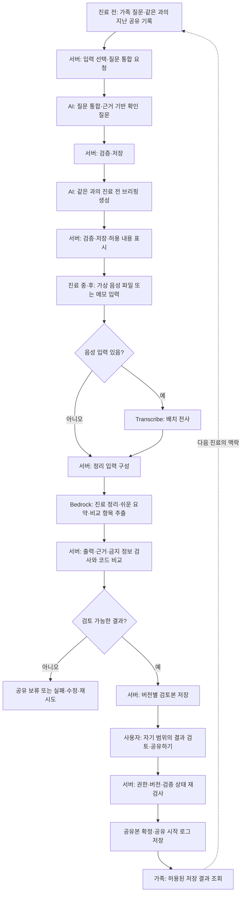

# 바통(Baton) AI 워크플로 설계

**작성일**: 2026-10-09

**상태**: 구현 전 설계 기록. 실제 AI 호출·기능·검증 결과는 아직 없다.

**근거**: [AI 활용·Agent 도입 기준](AI.md), [명세](../specs/001-baton-mvp/spec.md), [계획](../specs/001-baton-mvp/plan.md), [데이터 모델](../specs/001-baton-mvp/data-model.md), [API 계약](../specs/001-baton-mvp/contracts/api.md), [계약 스키마](../specs/001-baton-mvp/contracts/schemas.md)

## 1. 구성 방향

현재 MVP는 서버가 수행 순서와 조건을 정하는 AI 워크플로로 구현한다.
AI는 전사·추출·질문 통합·브리핑·요약을 맡고, 서버는 권한·입력 선택·검증·저장·공유 상태를 관리한다.
진료 후 정리(record)의 공유 확정과 최종 확인은 권한 있는 사용자가 수행한다.
진료 전 질문 통합·브리핑은 검증 ready일 때 별도 공유 단계 없이 허용 범위에 제공한다.

AI Agent는 현재 필수 구성 요소가 아니다.
상황에 따라 자료를 추가 탐색하고 수행 단계를 선택해야 하는 요구가 생길 때 검토할 확장 방향이다.
이 문서는 기존 설계를 풀어 설명하며 별도의 Agent 구현이나 새 필수 작업을 추가하지 않는다.

## 2. 전체 흐름

위 도식은 사용자 여정이다. 각 생성 요청은 별도 작업이며, 질문 통합을 누를 때마다 전사·정리까지 자동 실행하는 구조는 아니다.
실패 경로는 전사·각 AI 호출·검증 단계에도 존재한다. 검증 실패 결과는 다음 생성 단계의 정상 입력이나 공유 후보로 사용하지 않는다.

## 3. 공통 실행 규칙

모든 생성 요청에서 먼저 사용자를 인증하고 환자 관계·행동 권한·입력 버전을 확인한다.
서버가 같은 환자·진료과와 생성 목적에 맞는 입력을 선택하며, 진료과 미확인 기록과 비공개 메모는 가족용 AI 입력에서 제외한다.

내부 생성 입력과 외부 열람 응답은 별도 경로다.
서버가 정리에 필요한 원본을 내부에서 처리하더라도 요청자에게 그 원본의 열람 권한이 생기지 않는다.
생성 결과와 작업 조회도 요청자의 현재 권한에 맞춰 반환한다.

동일 입력의 유효한 저장 결과는 재사용한다.
입력이 바뀌면 버전과 갱신 필요 상태를 관리하며, 이전 결과를 최신인 것처럼 표시하지 않는다.
모델의 출력 형식·근거를 서버에서 검사하고, 계획에 따라 검증 실패 시 최대 1회 재시도한다.
계속 실패하면 실패 또는 공유 보류 상태로 남긴다. 이 재시도 규칙은 모든 외부 서비스에 무제한 반복을 허용한다는 뜻이 아니다.

## 4. 진료 전 워크플로

### 4.1 가족 질문 통합(진료 때 물어볼 질문 정리)

환자와 가족이 각자 ‘다음 진료 때 의사에게 물어보고 싶은 질문’을 남기면,
AI가 비슷한 질문을 하나로 묶어 이번 동행자가 가져갈 질문 목록을 만든다.
같은 환자·같은 진료과의 이전 기록에 확인할 내용이 있으면 그에 근거한 질문도 더한다.
가족이 번갈아 동행할 때 다른 가족이 남긴 질문을 빠뜨리지 않게 하려는 기능이다.

사용 흐름은 다음과 같다.

1. 환자와 가족이 질문을 각각 등록한다. 각 질문에는 작성자와 등록 시각이 남는다.
2. 사용자가 **‘AI로 질문 정리하기’**를 누른다.
3. AI가 비슷한 질문을 묶고, 기록에 근거한 확인 질문을 추가한다.
4. 서버 검증을 통과한 결과를 보여준다. 합친 원 질문 번호와 ‘AI가 추가’ 표시를 함께 보여준다.
5. 사용자가 **‘이 질문으로 브리핑 만들기’**를 누르면 별도 생성 요청으로 진료 전 브리핑을 만든다.

#### 가상 데이터 예시: 질문 3개가 어떻게 정리되나요?

다음은 [가상 시드 이야기](../specs/001-baton-mvp/seed-story.md)에 있는 다음 내과 진료의 질문이다.

| 원 질문 | 작성자 | 질문 내용 |
|---|---|---|
| q_01 | 환자 | 혈압약을 줄인 뒤로 아침에 어지러운데 괜찮은 건가요? |
| q_02 | 가족 A | 어지럼증이 혈압약 때문인지 여쭤봐 주세요. |
| q_03 | 가족 B | 피검사 결과는 언제 나오나요? |

q_01과 q_02는 약 변경 뒤 어지럼증에 관한 질문이므로 하나로 묶는다.
q_03은 검사 결과에 관한 별도 질문이라 그대로 유지한다.
또 이전 기록에서 가족은 복용 시간을 ‘저녁’으로 적었는데 약봉투에는 ‘아침’이라고 되어 있어,
어느 시간에 먹어야 하는지 의사에게 확인할 질문을 추가한다.

| 정리 결과 | 의사에게 물어볼 질문 | 화면 표시 |
|---|---|---|
| 통합 질문 mq_01 | 혈압약을 반 정으로 줄인 뒤 아침에 어지러운데 괜찮은지 여쭤보기 | 질문 1·2를 합쳤어요 |
| 통합 질문 mq_02 | 피검사 결과는 언제 나오는지 여쭤보기 | 질문 3에서 가져왔어요 |
| AI 추가 질문 mq_03 | 혈압약을 아침과 저녁 중 언제 먹어야 하는지 확인하기 | AI가 추가 |

이 예시는 **원 질문 3개 → 통합 질문 2개 + AI 추가 질문 1개**, 즉 진료 때 물어볼 질문 총 3개가 된다.
질문 개수는 입력에 따라 달라지며, AI가 질문의 답이나 복용 방법을 결정하지 않는다.
정리 결과의 정확한 형태는 [질문 통합 fixture](../fixtures/expected/merge-questions/v_im_03.json)에 있다.

#### 처리와 공개 범위

| 구분 | 내용 |
|---|---|
| 시작 | 질문 등록 후 사용자가 ‘AI로 질문 정리하기’ 요청 |
| 입력 | 원 질문과 작성자·질문 ID, 같은 환자·진료과의 관련 기록 |
| AI 처리 | 비슷한 질문을 묶고, 기록에서 확인할 내용이 있으면 질문 추가 |
| 서버 검증 | 결과 형식, 합친 원 질문과의 연결, 추가 질문의 근거, 동행용 질문에 금지 정보가 섞였는지 확인 |
| 저장 | 동행 블록의 통합 질문, 전체 내용 블록의 근거 참조 |
| 표시 | 검증 ready 결과를 동행 이상에 허용 범위대로 제공. 근거 위치·원문은 전체 내용(full)에서만 제공 |

원 질문과 작성자는 그대로 보존하고, 통합 질문이 어떤 원 질문에서 나왔는지 연결해 둔다.
AI가 추가한 질문에는 ‘AI가 추가’ 표시를 붙이고 그 근거도 저장한다.
예시의 복용 시간 차이 상세와 원문은 전체 내용(full)에서만 보여주며, 동행(companion)에는 허용된 확인 질문을 보여준다.
진단명·수치 등이 섞인 원 질문은 그대로 동행에 공개하지 않고 기존 검증·격리 정책을 적용한다.
진료 전 질문 정리는 검증 ready일 때 별도 공유 확정 없이 허용 범위에 제공한다.

### 4.2 진료 전 브리핑

| 구분 | 내용 |
|---|---|
| 시작 | 브리핑 생성 요청. 조회만 하는 경우 저장본 사용 |
| 입력 | 같은 과의 지난 기록, 통합 질문, 열린 확인 항목, 시드 가족 관찰 |
| AI 처리 | 바뀐 점·질문, 근거 있는 관찰·검사·준비사항 정리 |
| 서버 검증 | 진료과 일치, 근거·빈 값·확인 상태, 블록별 정보 경계 |
| 저장·표시 | 동행에는 변화·질문, full에는 이유·원문·관찰·준비 등 상세 |

근거가 없는 준비사항은 빈 값과 ‘확인 필요’로 남긴다.
B(companion)는 변화·질문을 이어받고, 원문과 상세 검토는 환자 또는 A(full)가 수행한다.

## 5. 진료 중·후 워크플로

### 5.1 입력 수집과 음성 전사

1단계는 준비한 가상 음성 파일과 메모를 사용한다. 파일 업로드에서는 환자 관계·행동 권한·녹음 허용 설정을 확인한다.
음성이 있으면 Transcribe 배치 작업으로 전사한다. 메모만 있는 경우 전사 단계를 거치지 않고 정리 입력을 구성한다.

배치 전사는 기존 제공 S3 버킷을 임시 경유한다. 결과는 로컬에 저장하며 새 AWS 인프라를 배포하지 않는다.
원본 음성·전사 텍스트는 full 전용이다. 업로드한 작성자라도 companion이면 원문 읽기 권한은 없다.
전사 실패 시 준비된 전사본을 사용하려면 대체 사용임을 표시하고 후속 검증을 동일하게 적용한다.

### 5.2 진료 정리와 쉬운 말 요약

서버가 전사·메모·시드 처방·통합 질문 등 해당 생성 작업의 입력을 준비한다.
Bedrock은 일정·복약 변경·의사 설명·질문 답변 등을 추출하고 쉬운 말 요약을 함께 만든다.
쉬운 요약을 위해 별도 조회 시 AI를 다시 호출하지 않는다.

| 저장 블록 | 주요 결과 | 표시 원칙 |
|---|---|---|
| schedule | 다음 일정 | 일정만 이상 |
| companion | 약·용량 변경과 주의사항, 쉬운 요약, 허용 질문·변화 | 동행 이상. 진단명·검사 수치·변경 이유 제외 |
| full | 진단·수치·설명·답변·변경 이유, 원문·근거, 상세 확인 항목 | 전체 내용만 |

정해진 블록을 함께 생성하고 서버에서 검증·버전별 저장한다.
같은 값을 여러 블록에 중복 저장하지 않으며, 항목 ID를 통해 full의 근거 참조와 연결한다.
AI는 의학적 판단을 추가하지 않고, 근거 없는 값은 비운다.

### 5.3 처방·메모 불일치 비교

AI는 메모 등에서 약·복용 시간·용량을 비교 가능한 형태로 추출한다.
서버 코드가 이전·현재 처방 및 가족 메모의 대응 항목을 대조한다.
불일치가 있으면 두 근거·다른 값·확인 상태를 저장하고 full 사용자에게 상세를 제공한다.

사용자는 메모 수정·자료 재등록 안내·병원 확인 예정 등으로 처리한다.
어느 기록이 옳은지는 자동 선택하지 않는다. 미해결 상태는 다음 브리핑에서도 유지한다.

### 5.4 검증·검토본 저장

서버는 출력 계약·근거 연결·허용 항목과 민감 정보 혼입을 검사한다.
낮은 범위의 요약·주의사항·질문·일정 문장에 full의 진단명·검사 수치·사유가 섞였는지도 확인한다.

| 검토 상태 | 의미·처리 |
|---|---|
| generating | 처리 중. 아직 공유 가능한 결과 아님 |
| ready | 검토 가능한 결과. 사용자의 공유 확정은 아직 안 됨 |
| blocked | 민감 정보 혼입 등으로 공유 보류. 수정·재생성·재검증 필요 |
| failed | 처리 실패. 실패 안내와 재시도 경로 제공 |

일반적인 근거 누락·미해결 불일치는 ready 결과에서 ‘확인 필요’를 유지할 수 있다.
blocked·failed 결과는 공유 버튼으로 공개할 수 없다.
표현 변형과 약 이름에서의 진단 추론은 문자열 검사만으로 완전히 차단할 수 없으며 모의 평가에 한계를 기록한다.

### 5.5 사용자 검토·공유 확정

작성자 또는 환자·위임된 대표 보호자가 자기 범위 안에서 검토본을 확인한다.
사용자가 ‘공유하기’를 누르면 서버가 현재 권한·입력 버전·검토 상태를 다시 검사한다.
ready이면서 조건을 만족하는 결과만 공유본으로 확정하고 공유 시작 로그를 같은 트랜잭션으로 저장한다.

공유 전 다른 가족에게 새 검토본을 자동 공개하지 않는다.
재정리 중에는 기존 공유본을 보존하고, 입력이 오래된 검토본의 신규 공유는 거부한다.
반복 요청으로 중복 공유·중복 로그가 발생하지 않게 처리한다.

## 6. 조회와 범위 변경

가족 조회는 현재 환자 관계와 열람 범위를 확인한 뒤 공유된 버전의 허용 블록만 읽는다.
검토본 조회는 작성자·관리자의 검토 권한과 현재 열람 범위를 추가로 확인한다.

| 열람 범위 | 조회 결과 |
|---|---|
| 일정만 | 공통 메타 + schedule |
| 동행 | 공통 메타 + schedule + companion |
| 전체 내용 | 공통 메타 + schedule + companion + full |

거부 블록을 모두 읽어 놓고 나중에 삭제하는 방식은 사용하지 않는다.
원문·다운로드·질문·알림·작업 결과에도 현재 권한 검사를 적용한다.
범위 변경은 구성원 정보와 변경 로그를 함께 저장하고 프론트의 이전 응답 캐시를 비운 뒤 재조회한다.
조회·화면 이동·범위 변경으로 발생하는 LLM·STT 추가 호출은 0회여야 한다.

## 7. 비동기 작업과 API 연결

| 작업 | 생성 요청 경로 | 결과 확인 |
|---|---|---|
| 질문 통합 | POST /visits/{vid}/questions/merge | 202 jobId |
| 브리핑 | POST /visits/{vid}/briefing | 202 jobId |
| 전사 | POST /visits/{vid}/transcribe | 202 jobId |
| 진료 정리 | POST /visits/{vid}/structure | 202 jobId |
| 공유 확정 | POST /visits/{vid}/share | 서버 조건 확인 후 공유 상태 |

환자 경로에는 /api/patients/{patientId}가 앞에 붙는다. 작업 조회는 /api/jobs/{jobId}다. 상세 계약은 contracts/schemas.md를 따른다.
긴 작업은 queued → running → succeeded/failed 상태를 갖고 GET /jobs/{jobId}로 조회한다.
프론트는 2초 간격으로 조회하고 종료 상태에서 폴링을 중단한다.
서버 재시작 시 남은 running 작업은 failed로 전환해 재시도 경로를 제공한다.

작업 성공은 처리 완료를 의미하며 공유 완료를 의미하지 않는다.
작업 응답은 안전한 상태·출처 모드·결과 버전 참조를 제공한다. 원문을 직접 포함하지 않는다.
fixture 결과도 같은 검증을 거치고 실제 호출 결과와 구분한다.

## 8. 선택 2단계와 Agent 확장

직접 녹음·문서 사진 판독·기록 흐름 보기 등 Tier C 작업은 핵심 시연 완주 후 사람이 명시적으로 요청할 때만 추가한다.
문서 판독은 원본·항목별 근거·직접 수정 이력을 저장하며, 쉬운 요약 전용 화면은 기존 결과를 재사용한다.

향후 Agent는 ‘이번 진료 준비’ 목표에 따라 허용된 과거 자료를 추가 조회하고 질문·브리핑 초안을 만드는 역할로 검토한다.
도입하더라도 서버의 환자·진료과·도구 권한 제한과 결과 검증은 유지한다.
공유 확정·공개 범위 변경을 자율 수행하지 않으며 반복 횟수·예산·종료 조건은 도입 시 설계한다.

## 9. 구현 시 검증할 항목

- 같은 환자·진료과의 입력만 사용하고 비공개 메모가 포함되지 않는지 확인한다.
- 질문 통합 관계·근거·빈 값·확인 필요 표시를 확인한다.
- 금지 정보 혼입·검증 실패·오래된 버전의 공유가 거부되는지 확인한다.
- 불일치의 두 근거와 미해결 상태 유지, 코드 비교 결과를 확인한다.
- full 밖에서 원문·인용·다운로드·작업 응답으로 정보가 전달되지 않는지 확인한다.
- 조회·범위 변경의 추가 AI 호출 0회, 중복 요청과 실패·재시작 처리를 확인한다.
- 실제 호출·대체 결과·시드·화면 시연을 구분해 두 핵심 시연 경로를 검증한다.

상세 수용 기준과 작업 순서는 기존 [spec.md](../specs/001-baton-mvp/spec.md)와 [tasks.md](../specs/001-baton-mvp/tasks.md)를 따른다.
