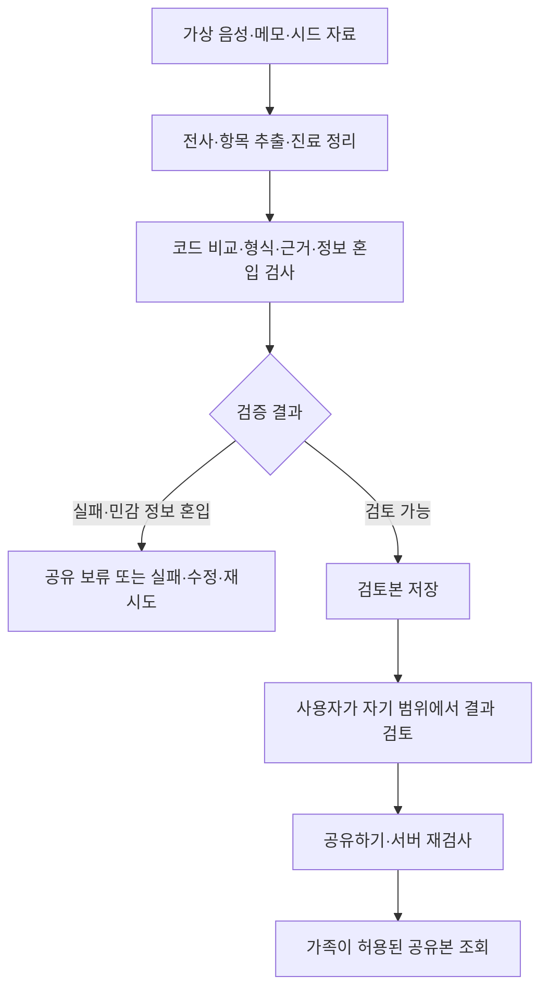

# 바통(Baton)의 AI 활용과 AI Agent 도입 기준

**작성일**: 2026-10-09

**상태**: 현재 설계 설명과 향후 확장 제안. 기능 구현·검증 결과는 아니다.

**근거**: [MVP 명세](../specs/001-baton-mvp/spec.md), [구현 계획](../specs/001-baton-mvp/plan.md)

**상세 처리 흐름**: [AI 워크플로 설계](AI-workflow.md)

## 1. 현재 판단

바통에서는 질문 통합·진료 브리핑·음성 인식·기록 정리에 AI를 활용한다.
현재 제품 요구사항에는 자율적으로 도구와 수행 순서를 선택하는 AI Agent가 반드시 필요한 기능은 없다.
입력 자료와 처리 순서가 정해져 있으므로, 우선 서버가 AI 호출과 검증을 연결하는 파이프라인으로 구현한다.

자료 탐색과 후속 작업이 상황에 따라 달라지는 요구가 생기면 ‘진료 인수인계 준비 Agent’를 검토할 수 있다.
이는 향후 확장 제안이며 현재 spec·plan·tasks의 필수 범위를 변경하지 않는다.

## 2. AI 기능과 AI Agent의 구분

| 구분 | 이 문서에서 사용하는 의미 | 바통의 예 |
|---|---|---|
| AI 기능 | 정해진 입력을 받아 전사·추출·통합·요약 수행 | 메모와 전사본으로 진료 정리 생성 |
| AI 파이프라인 | 서버가 정한 순서로 AI 호출·검증·저장을 연결 | 음성 전사 → 정리 → 서버 검증 → 검토본 저장 |
| AI Agent | 목표에 따라 필요한 자료·도구·다음 단계를 모델이 선택하며 수행 | 근거가 부족하면 허용된 과거 기록을 추가 조회해 브리핑 준비 |

여러 작업이 자동 실행되거나 비동기로 처리된다는 사실만으로 자율 Agent가 되는 것은 아니다.
Bedrock의 tool use로 JSON 형식의 출력을 받는 것만으로도 Agent 구조가 되지는 않는다.

## 3. 서비스에서 AI가 활용되는 부분

| 기능 | AI가 맡는 일 | 서버·사용자가 맡는 일 | 구현 단계 |
|---|---|---|---|
| 가족 질문 통합(진료 때 물어볼 질문 정리) | 환자와 가족이 남긴 질문 중 비슷한 것을 묶고, 이전 기록에서 확인할 질문 추가 | 원 질문·작성자·합친 관계 보존, 권한·출력 검사 | 1단계 |
| 진료 전 브리핑 | 같은 진료과 기록에서 바뀐 점과 질문 정리 | 같은 환자·진료과의 적법한 입력 선택, 권한 검사 | 1단계 |
| 음성 인식 | 준비한 가상 음성을 텍스트로 전사 | 업로드·작업 상태·실패 처리, 대체 전사본 사용 표시 | 1단계 |
| 진료 후 정리 | 전사·메모·시드 자료에서 복약 변경·설명·일정·답변 추출 | 근거·출력 형식·민감 정보 혼입 검사, 검토본 저장 | 1단계 |
| 쉬운 말 요약 | 기록을 쉬운 표현으로 정리 | 금지 정보 검사, 저장 결과 표시 | 생성 1단계, 전용 화면은 선택 2단계 |
| 처방·메모 비교 | 자유로운 문장을 약·복용 시간·용량 같은 비교 항목으로 추출 | 차이는 코드로 비교하고 어느 기록이 맞는지는 사람이 확인 | 1단계 |
| 문서 사진 판독 | 처방전·약봉투 등에서 항목과 근거 추출 | 원본 보존·직접 수정·수정 이력 관리 | 선택 2단계 |
| 기록 흐름 연결 | 같은 과 기록을 결정 → 관찰 → 확인 예정으로 연결 | 허용된 정보만 제공하고 의학적 해석이 추가되지 않았는지 검사 | 선택 2단계 |

AI는 기록에 없는 답변이나 준비사항을 지어내지 않는다.
근거가 없으면 값을 비우고 ‘확인 필요’로 남긴다.
모든 사실 항목의 내부 근거를 저장하고 원문·인용·근거 위치는 전체 내용 권한에서만 제공한다.

### 가족 질문 통합은 어떤 기능인가요?

**환자와 가족이 다음 진료 때 물어보려고 남긴 질문들을, AI가 의사에게 물어볼 목록으로 정리하는 기능**이다.
가족이 번갈아 진료에 동행하더라도 이번에 동행하는 사람이 다른 가족의 질문을 빠뜨리지 않도록 돕는다.

예를 들어 다음은 기존 가상 시드의 질문 3개다.

- 환자: “혈압약을 줄인 뒤로 아침에 어지러운데 괜찮은 건가요?”
- 가족 A: “어지럼증이 혈압약 때문인지 여쭤봐 주세요.”
- 가족 B: “피검사 결과는 언제 나오나요?”

앞의 두 질문은 같은 걱정에 관한 내용이므로 하나로 묶고, 검사 결과 질문은 따로 유지한다.
이전 기록에서 가족이 적은 복용 시간과 약봉투의 복용 시간이 다르면,
“혈압약을 아침과 저녁 중 언제 먹어야 하는지 확인하기”라는 질문도 추가한다.
이 예시의 결과는 **원 질문 3개 → 통합 질문 2개 + AI 추가 질문 1개**다. 질문 개수는 입력에 따라 달라진다.

원 질문과 작성자는 그대로 보존하고, 어떤 질문을 합쳤는지 표시한다. 새로 더한 질문에는 ‘AI가 추가’ 표시를 붙인다.
AI는 질문을 정리하며, 질문의 답이나 복용 방법을 결정하지 않는다. 추가 질문은 같은 환자·같은 진료과의 기록에 근거해야 한다.
정리된 질문은 별도로 요청하는 진료 전 브리핑의 ‘오늘 물어볼 질문’에 들어간다.

사용자 화면에서는 **‘AI로 질문 정리하기’**라는 버튼으로 이 기능을 요청한다.
구체적인 흐름과 정리 결과는 [AI 워크플로의 가족 질문 통합](AI-workflow.md#41-가족-질문-통합진료-때-물어볼-질문-정리),
[가상 시드 이야기](../specs/001-baton-mvp/seed-story.md)에서 확인할 수 있다.

## 4. AI에게 맡기지 않는 책임

| 책임 | 담당 |
|---|---|
| 사용자 인증·환자 관계·현재 열람 범위 검사 | 서버 |
| 같은 환자·진료과의 생성 입력 선택, 비공개 메모 제외 | 서버 |
| 허용된 정보 묶음만 조회하고 응답 구성 | 서버 |
| 출력 형식·근거 연결·알려진 민감 정보 혼입 검사 | 서버 |
| 약·복용 시간·용량의 추출 결과 간 차이 비교 | 서버 코드 |
| 어느 기록이 맞는지 확인, 메모 수정·병원 확인 예정 처리 | 권한 있는 사용자 |
| 가족별 공개 범위 변경 | 환자 또는 위임된 대표 보호자 |
| 검토한 결과의 공유 확정 | 작성자 또는 범위 관리자가 자기 권한 안에서 수행 |

진단·처방 결정·검사 수치 해석·치료 권고 생성은 서비스 범위 밖이다.
모델 출력은 서버 검증을 거쳐야 하며 AI가 권한을 확대하거나 공유 보류를 해제할 수 없다.
문자열 검사는 표현을 바꾼 민감 정보나 약 이름에서의 진단 추론을 완전히 막지 못하므로 평가에 한계를 기록한다.

## 5. 현재 MVP의 처리 흐름

정리 시 schedule·companion·full의 정보를 구분해 함께 저장한다.
쉬운 말 요약도 이 정리 과정에서 생성하며, 조회·화면 이동·범위 변경에서는 저장 결과를 사용한다.
이러한 조회와 범위 변경 때문에 AI를 다시 호출하지 않는다.

일반적인 근거 누락·미해결 불일치는 ‘확인 필요’를 유지한 채 허용 내용 검토 후 공유할 수 있다.
민감 정보 혼입·검증 실패·오래된 입력 버전의 결과는 공유 요청으로 우회할 수 없다.
외부 호출이 실패하면 준비된 가상 결과를 같은 검증 경로로 처리하고 대체 사용임을 표시한다.

## 6. Agent를 도입한다면: 진료 인수인계 준비

**향후 확장 예시**: 사용자가 ‘이번 내과 진료 준비해줘’라고 요청하면 Agent가 필요한 자료와 처리 단계를 선택한다.

1. 서버가 해당 생성 작업에 허용한 같은 환자·진료과의 기록을 조회한다.
2. 지난 변화·미해결 확인 항목·가족 질문을 살펴본다.
3. 필요한 근거가 부족하면 허용된 과거 기록을 추가 조회한다.
4. 브리핑과 질문 초안을 만든다.
5. 서버 검증과 열람 범위 적용을 거쳐 사용자에게 검토 결과를 보여준다.

상황에 따라 필요한 자료가 달라지고 추가 조회가 필요한 경우에 Agent의 활용 이유가 생긴다.
현재처럼 대상 기록과 처리 순서가 정해진 경우에는 일반 AI 파이프라인으로 충분하다.

도입 시에도 서버가 도구별 접근 권한과 허용 범위를 검사한다.
기록 조회 도구는 임의 환자·진료과나 비공개 메모에 접근할 수 없게 제한한다.
반복 횟수·호출 예산·종료 조건을 정하고 실패·근거 부족을 명시적으로 표시한다.
공유 확정과 공개 범위 변경은 자율 실행 대상에 넣지 않는다.
이 도구 계약과 제한은 실제 Agent 도입을 결정할 때 구체화한다.

## 7. 구현 우선순위

먼저 질문 통합·브리핑·진료 정리와 서버의 권한·근거·공유 검증을 완성한다.
이어받기와 범위 변경의 두 시연 경로를 검증한 뒤 사람이 명시적으로 요청할 때만 선택 2단계 기능(Tier C)을 추가한다.
자료 탐색이 복잡해져 고정 파이프라인으로 사용자의 준비 작업을 충분히 처리하기 어려울 때 Agent 도입을 검토한다.

현재 필수 구현에는 별도의 자율 Agent나 여러 Agent 간 협업을 추가하지 않는다.
향후 채택 시 변경 이유·수용 기준을 spec에 기록하고 plan·tasks에 설계와 검증 작업을 반영한다.
