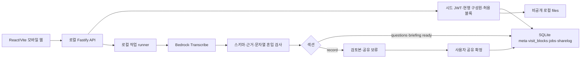

# 바통 아키텍처 — 최종 기획안 반영

사용자 선택: 로컬 서버·SQLite·시드 로그인, AI만 AWS. 배포 없이 로컬 시연한다.
현재는 문서와 빈 소스 폴더이며 아래 흐름은 향후 구현 설계다.

- web: 낮은 범위에 없는 블록을 그리지 않고 원문 버튼은 full일 때만 표시한다.
- api: JWT 검증 후 매 요청의 DB 관계로 행동·블록·원문 권한을 검사한다.
- contracts: schedule/companion/full DTO·요청·오류·작업 상태·런타임 검증 스키마.
- adapters: SQLite·로컬 files·AWS AI·fixture. 앱 저장·인증에는 AWS를 사용하지 않는다.
- workers: 작업 ID·SQLite 상태·재시도·재시작 실패 처리. 클라우드 배포 없음.
- fixtures: 가족 4계정·테스트 비구성원 1계정·관찰 메모·저장 결과·AI 응답·혼입 샘플과 기대 라벨을 준비했다. 음성 파일·약20 모의 문서는 아직 없으며 T065는 축소 평가로 실제 분모를 기록한다.

AI 생성은 questions·briefing·record 섹션별로 세 블록을 함께 저장한다.
questions·briefing은 ready 결과를 허용 범위에 바로 제공하고 record만 검토 후 공유하기로 확정한다.
조회와 범위 변경은 허용 블록만 읽고 AI 호출은0회다.
companion에는 원문·인용·근거 위치·변경 이유가 없고, 상세 불일치는 full에만 있다.
Transcribe 배치에는 기존 제공 S3 버킷의 임시 staging이 필요하며 영구 자료는 로컬에 둔다.

설계: [plan](../specs/001-baton-mvp/plan.md) · [data model](../specs/001-baton-mvp/data-model.md)
· [contract](../specs/001-baton-mvp/contracts/api.md) · [tasks](../specs/001-baton-mvp/tasks.md).
