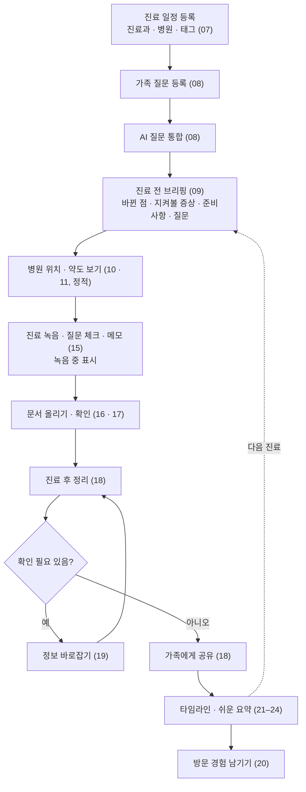
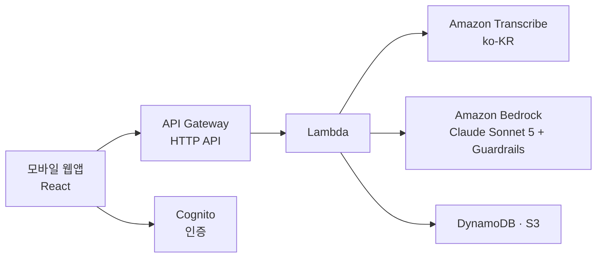

# 바통(Baton) — 진료 동행 노트 · 기획 문서

> **저장소 등록 일시** 2026-10-09 04:15:10 KST (UTC+09:00)

> **행사** DevDay Exchange Community Hackathon Seoul (AWS Korea) · 2026-10-09 · AI for Human Life 트랙
> **문서 기준일** 2026-10-09 (10/9 회의 결정 반영)
> **근거 자료** 팀 대화 기록 · 10/9 회의 메모 · 노션 'AWS DevDay' 페이지(하위 페이지와 작업 보드 · 이슈 DB 포함) · UI 와이어프레임 v6
> **용도** 스펙 문서 작성의 입력 자료. 이 문서는 "무엇을, 누구를 위해, 왜"를 정리하고, API · 데이터 구조는 부록에 **초안**으로만 둡니다.

### 표기 규칙

| 표시 | 뜻 |
|---|---|
| `[확정]` | 팀이 합의한 내용 |
| `[제안]` | 의견은 나왔으나 합의 전 |
| `[확인 필요]` | 행사 측 · AWS · 법률 등 외부 확인이 필요 |
| `[미정]` | 논의가 열려 있음 |

자료끼리 내용이 다른 곳은 본문에 ⚠ 로 표시하고 [14.3 자료 간 상충](#143-자료-간-상충-이-문서를-정리하며-발견)에 모았습니다.

---

## 목차

1. [한눈에 보기](#1-한눈에-보기)
2. [기획 배경과 변천](#2-기획-배경과-변천)
3. [사용자와 역할](#3-사용자와-역할)
4. [설계 원칙](#4-설계-원칙)
5. [핵심 사용 흐름과 데모 시나리오](#5-핵심-사용-흐름과-데모-시나리오)
6. [기능 목록](#6-기능-목록)
7. [화면 명세 (와이어프레임 v6)](#7-화면-명세-와이어프레임-v6)
8. [공개 범위와 권한](#8-공개-범위와-권한)
9. [AI 활용](#9-ai-활용)
10. [기술 구성](#10-기술-구성)
11. [구현 범위와 당일 일정](#11-구현-범위와-당일-일정)
12. [검증 계획](#12-검증-계획)
13. [결정 사항 기록](#13-결정-사항-기록)
14. [미결 사항](#14-미결-사항)
15. [출처](#15-출처)
- [부록 A. 데이터 구조 초안](#부록-a-데이터-구조-초안)
- [부록 B. API 목록 초안](#부록-b-api-목록-초안)

---

## 1. 한눈에 보기

| 항목 | 내용 |
|---|---|
| 서비스명 | **바통(Baton)** — 진료 동행 노트 `[확정]` |
| 한 줄 정의 | 진료의 바통을 가족끼리 이어 준다 `[확정]` (10/9 변경 — 이전: 4분 진료를 8분처럼 쓰게 해준다) |
| 핵심 가치 | 가족이 번갈아 동행해도 진료 맥락이 끊기지 않는 **'진료 인수인계'** |
| 대상 | 보호자 동행이 필요한 환자 전반 — 고령자, 어린이, 장애인, 노약자 등 `[확정]` |
| 형태 | React 기반 모바일 우선 웹앱 |
| 팀 · 시간 | 4명 · 해커톤 당일 개발 가능 시간 약 5시간 |

**문제** 진료 시간은 짧고, 동행하는 가족이 바뀔 때마다 지난 진료의 맥락(증상, 복약 변경, 다음 일정)이 끊깁니다.

**해결** 진료 전 · 중 · 후를 하나의 기록으로 이어서, 누가 동행하든 직전까지의 맥락을 이어받게 합니다.

| 진료 전 | 진료 중 | 진료 후 |
|---|---|---|
| 지난 진료 이후 바뀐 점 요약 | 녹음 기본 + 직접 입력 보완 | 쉬운 말 요약 · 복약 변경 · 다음 일정 |
| 질문 리스트 (AI 추천 + 가족 질문 병합) | 녹음 중임을 화면에 분명하게 표시 | 권한 있는 가족에게 공유 |
| 병원 위치 · 약도 보기 (정적) | 질문 체크 · 의사에게 보여줄 요약 화면 | 환자는 쉬운 말 요약 · 복약 · 다음 예약 알림 수신 |

모든 화면은 설정에서 글씨 크기와 고대비를 바꿀 수 있어야 합니다. `[확정]` (10/9)

---

## 2. 기획 배경과 변천

### 2.1 아이디어 선정

팀원 본인의 불편에서 출발한 후보 두 개를 거쳐 '진료 동행 노트'로 확정했습니다.

| 후보 | 내용 | 결과 |
|---|---|---|
| 연락 · 정보 과부하 정리 | 여러 매체로 들어오는 연락과 정보를 정리 | 채택 안 함 |
| 블랙박스 영상 관리 | 감탄사를 트리거로 1분 녹화 | 채택 안 함 |
| **진료 동행 노트** | 진료 전 · 후 정리와 가족 공유 | **확정** |

### 2.2 방향 변경

| 시점 | 변경 | 이유 · 비고 |
|---|---|---|
| 초안 | 혼자 병원에 가는 고령자 본인이 주 페르소나. 진료 전 증상 · 질문 정리, 진료 후 쉬운 말 요약 · 복약 변경 · 다음 일정을 가족과 공유 | — |
| 2026-10-04 | **환자와 보호자가 함께 동행하는 경우**로 전환. 핵심은 '진료 인수인계' | 기존 '혼자 가는 어르신' 전제를 대체 `[확정]` |
| 2026-10-04 | 대상을 보호자 동행이 필요한 환자 전반으로 확대, 용어를 '환자 · 보호자'로 통일 | `[확정]` |
| 2026-10-04 | 외국어 지원 추가 — 해외 장기 여행 · 체류 중 받은 진료를 귀국 후 이어 받기 쉽게. 한국 → 해외 방향(현지 의사용 번역)으로도 활용 | 이번 구현에서는 제외, 와이어프레임으로만 제시 |
| 2026-10-04 | 병원 약도 · 원내 동선 추가 | 10/9에 정적 처리로 정리 (아래) |
| 2026-10-04 | 구현은 해커톤 당일에만 | 사전 개발분과 당일 개발분의 구분 · 인정 범위를 미리 판단하기 어려움 `[확정]` |
| 2026-10-09 | 한 줄 정의를 "진료의 바통을 가족끼리 이어 준다"로 변경 | `[확정]` |
| 2026-10-09 | 원내 약도 · 동선 기능 제외. 지도 · 약도는 동적 기능 없이 정적으로 데모에서 보여주기만. 병원 위치는 카카오 또는 네이버 지도 API로 표시하고 길찾기 · 가는 법 안내는 넣지 않음 | 구현이 까다로움 `[확정]` |
| 2026-10-09 | 녹음 동의 확인 단계 제거. 대신 녹음 중임을 화면에 분명하게 표시. 녹음 아래 실시간 자막은 추가 과제 | 의사 동의 없이도 임의로 체크할 수 있어 실효성이 없음 `[확정]` · 자막 `[제안]` |
| 2026-10-09 | 방문 경험은 데모에서 더미 데이터(임의의 메모 · 댓글)로 보여줌 | `[제안]` |
| 2026-10-09 | 언어 · 해외 진료는 이번 데모에서 후순위 | `[확정]` |
| 2026-10-09 | 글씨 크기 · 고대비 설정 필수. 돋보기 기능은 일단 반려 | `[확정]` |

### 2.3 와이어프레임 버전

| 버전 | 주제 | 화면 수 | 주요 변화 |
|---|---|---|---|
| v1 | 프로필 선택 | 11 | 프로필 선택 → 홈 → 질문 → 브리핑 → 녹음 → 정리 → 가족별 타임라인 → 설정 · 언어 · 해외 진료 |
| v2 | 로그인 | 17 | 프로필 선택을 **계정별 로그인**으로 교체, '누구의 기록을 볼지' 칩, 가족 연결(초대 코드), 문서 올리기 · 문서 확인, 진료 일정 등록(진료과 · 태그) 추가 |
| v3 | 해외 진료 · 번역 | 19 | 해외 진료용 요약 만들기 · 요약 미리보기 추가, 진료 후 정리에 보기 언어 토글 |
| v4 | 병원 약도 · 동선 | 22 | 병원 위치 · 원내 동선 · 방문 경험 남기기 추가 |
| v5 | 솔루션 빈칸 메우기 | 29 | 환자 홈, 비공개 메모, 진료실에서 보여주기, 녹음 동의 확인, 정보 바로잡기(메모 vs 약봉투), 타임라인 흐름, 쉬운 진료 요약 추가 |
| **v6** | 10/9 회의 반영 | **29** | 10 · 11 정적화(길찾기 · 층 선택 · 경험 비교 제외, 경험 메모는 더미), 14 녹음 동의 제거, 15 녹음 중 표시 강화 · 실시간 자막(추가 과제), 25 글씨 크기 · 고대비 추가, 25-1 적용 예 추가, 26–29 후순위 표시 |

이 문서의 화면 번호는 **v6 기준**입니다. v6은 v5와 번호가 같고, 14번(녹음 동의 확인)을 빼고 25-1(큰 글씨 · 고대비 적용 예)을 더했습니다.

---

## 3. 사용자와 역할

### 3.1 역할

모든 사용자는 **자기 계정으로 로그인**합니다. 보호자도 언제든 환자가 될 수 있으므로, 한 계정이 '내 기록'과 '연결된 가족의 기록'을 함께 가집니다. `[제안 — 와이어프레임 v2부터 반영]`

| 역할 | 설명 | 주요 권한 |
|---|---|---|
| **환자** (기록 주인) | 진료를 받는 사람 | 자기 기록 전체 열람, 가족별 공유 범위 변경, 대표 보호자 위임 설정, 진료 녹음 허용, 비공개 메모(본인만). 쉬운 말 요약 · 복약 · 다음 예약 알림 수신 |
| **대표 보호자** | 환자가 직접 설정하기 어려울 때 대신 관리하는 보호자 | 전체 내용 열람. **위임이 켜져 있을 때만** 공유 범위 변경 대행. 비공개 메모는 볼 수 없음 |
| **보호자** | 연결된 가족 | 부여받은 등급만큼 열람, 질문 등록, 동행 시 기록. 다른 가족의 등급은 볼 수 없음 |

- 설정은 **환자 직접이 기본**, 어려우면 대표 보호자가 대행합니다. `[확정]`
- 데모에서는 시드 계정 3개(환자 · 대표 보호자 · 보호자)를 씁니다.

### 3.2 아직 정리하지 않은 사용자 유형 `[미정]`

노션 '공개 범위' 페이지에 "사용자별로 서비스 이용 흐름을 정리해야 함"이라는 메모와 함께 아래 유형이 적혀 있습니다. 스펙 문서 전에 역할 정의가 필요합니다.

1. 환자
2. 대표 보호자
3. 보호자
4. 동행자
5. 베이비시터

함께 나온 아이디어:
- **제3자(요양보호사 등)** — 이번 구현에서 제외. 확장 시 보호자와 별도 역할, 환자가 항목별로 켜는 방식(opt-in), 기본은 업무상 최소 범위(일정 · 복약 알림 · 주의사항), 동의 기록 · 철회 · 열람 로그. `[제안]`
- 와이어프레임 메모: "환자 – 제3자 – 보호자의 중개 플랫폼" 방향.

---

## 4. 설계 원칙

| # | 원칙 | 근거 · 상태 |
|---|---|---|
| P1 | **이어받기** — 누가 동행하든 진료 직전 브리핑으로 지난 맥락을 이어받는다 | 데모 핵심 장면 `[확정]` |
| P2 | **같은 진료과끼리만 맥락을 잇는다** — 진료과 태그로 분류하고, AI 입력에도 같은 과 기록만 넣어 컨텍스트 오염을 막는다 | `[제안]` ⚠ 와이어프레임 · 기능 정리에는 이미 전제로 반영 |
| P3 | **AI는 정리만** — 진단 · 처방 · 검사 수치 해석을 하지 않는다. 두 기록이 다르면 다르다는 것만 알리고 어느 쪽이 맞는지 판단하지 않는다 | 화면 문구로도 명시(09 · 19 · 22) |
| P4 | **근거가 없으면 비운다** — 모든 AI 출력 항목에 원문 위치를 달고, 근거가 없으면 값을 비운 채 '확인 필요'로 표시한다 | 기능 정리 |
| P5 | **원문으로 돌아갈 수 있게** — 요약 · 비교 · 번역 항목마다 '원문 보기'를 둔다 | 와이어프레임 전반 |
| P6 | **등급을 드러내지 않는다** — 가족별 열람 등급은 다른 보호자 화면에 보이지 않는다. 권한 밖 항목은 '숨김 N개' 같은 표시 없이 처음부터 없는 것처럼 보여준다 | 등급 비노출 `[확정]` · 없는 것처럼 표시 `[제안]` |
| P7 | **권한은 서버에서 거른다** — 화면에서 숨기는 것이 아니라 서버가 열람자 권한으로 걸러서 응답한다 | `[제안]` |
| P8 | **지도 · 약도는 정적으로** — 병원 위치와 원내 약도는 보여주기만 하고, 길찾기 · 가는 법 안내 · 동선 계산은 하지 않는다. 이용자 경험은 참고용 메모로만 둔다 | `[확정]` (10/9, 이전 '공식 안내 우선 + 경험으로 예상 순서 제안'을 대체) |
| P9 | **누구나 읽을 수 있게** — 환자 화면은 쉬운 말로, 모든 화면은 글씨 크기 · 고대비를 바꿀 수 있게 | 글씨 크기 · 고대비 `[확정]` (10/9) · 와이어프레임 05 · 13 · 24 · 25 · 25-1 |
| P10 | **녹음은 숨기지 않는다** — 녹음 중일 때는 화면에서 분명하게 드러낸다 | `[확정]` (10/9) |

---

## 5. 핵심 사용 흐름과 데모 시나리오

### 5.1 전체 흐름



### 5.2 단계별 정리

| 단계 | 사용자 행동 | 화면 |
|---|---|---|
| 진료 전 | 일정 등록, 가족이 각자 질문 남기기, AI가 질문 통합, 진료 직전 브리핑 확인, 병원 위치 · 원내 약도 보기(정적). 환자는 비공개 메모를 남기고 진료실에서 보여줄 화면 준비 | 07 · 08 · 09 · 10 · 11 · 12 · 13 |
| 진료 중 | 녹음(녹음 중 표시, 실시간 자막은 추가 과제), 질문 체크, 메모, 처방전 · 약봉투 사진 | 15 · 16 |
| 진료 후 | AI가 녹음 · 메모 · 문서를 정리 → 확인 필요 처리 → 가족에게 공유, 방문 경험 남기기 | 17 · 18 · 19 · 20 |
| 기록 보기 | 진료과별 타임라인, 흐름 보기, 일정만 보는 가족 화면, 환자용 쉬운 요약 | 21 · 22 · 23 · 24 |
| 설정 · 해외 | 글씨 크기 · 고대비, 공유 범위 · 위임 · 녹음 허용 · 알림 / 언어 · 해외 진료 기록 · 해외 진료용 요약(후순위) | 25 · 25-1 · 26–29 |

### 5.3 데모 시나리오 `[제안]`

핵심 장면은 **진료 직전 브리핑으로 맥락을 이어받는 순간**입니다.

1. 보호자 A가 지난 진료에 동행해 기록이 쌓여 있습니다 (시드 데이터).
2. 이번에는 보호자 B가 동행합니다. B가 자기 계정으로 로그인합니다.
3. 진료 직전 첫 화면에서 '지난 진료 이후 바뀐 점'과 질문 리스트를 확인합니다.
4. 진료 중 녹음하고 질문을 체크합니다.
5. 진료 후 정리 기록이 권한 있는 가족에게 즉시 공유되고, 처방 변경이 이전과 비교되어 보입니다.

> ⚠ 와이어프레임의 예시 데이터는 이 시나리오와 다릅니다(1월 A · 2월 B · 3월 A 동행, 일정만 공유받는 예시도 보호자 B). 시드 데이터와 화면 예시를 하나로 맞춰야 합니다 → 14.3 ④

데모에 쓰는 시드 시나리오(기능 정리 기준):
- 환자 1명, 내과 1 · 2월 진료 기록과 3월 예정 진료, 정형외과 2월 기록
- 확인 필요 1건: 가족 메모 '저녁 혈압약 반 알로 줄임' vs 약봉투 '아침 약 용량 변경'
- 가족 질문 3개 → AI가 2개로 통합 + 기록에서 더한 확인 질문 1개
- 방문 경험: 같은 병원 · 내과의 더미 경험 메모(임의의 댓글) 몇 개 `[제안]`

---

## 6. 기능 목록

단계 표기: **1단계** 당일 우선 구현 · **2단계** 1단계 이후 · **화면만** 구현하지 않고 와이어프레임으로 발표 · **정적** 동적 기능 없이 고정된 지도 · 이미지로 보여주기만 · **제외** 만들지 않음 · **(제안)** 계획서에 없어 단계를 임시로 정한 것

| ID | 기능 | 설명 | 화면 | 단계 |
|---|---|---|---|---|
| F01 | 계정 로그인 | 이메일 · 비밀번호. 가입 · 비밀번호 찾기는 화면만 | 01 | 1단계 |
| F02 | 기록 주인 선택 | '누구의 진료 기록을 볼까요?' 칩(나 / 연결된 환자) | 02 · 03 | 1단계 (03은 제안) |
| F03 | 홈 요약 | 다음 진료, 확인 필요 수, 가족 질문 수, 진료과별 최근 기록 | 02 · 04 | 1단계 |
| F04 | 가족 연결 | 초대 코드 생성(1회용) · 입력, 처음 공유할 범위 선택 | 06 | 화면만 (가족 관계는 시드) |
| F05 | 진료 일정 등록 | 진료과 · 병원 · 날짜 · 시간 · 태그, 예약 문자 · 안내문 사진으로 채우기 | 07 | 화면만 (제안), 진료는 시드 |
| F06 | 가족 질문 통합 | 가족이 각자 질문 등록 → AI가 비슷한 질문을 합치고 기록 기반 확인 질문을 추가 | 08 | 1단계 |
| F07 | 진료 전 브리핑 | 같은 진료과 지난 기록 기반: 바뀐 점 · 지켜볼 증상 · 먼저 받을 검사 · 준비사항 · 오늘 물어볼 질문 | 09 | 1단계 (데모 핵심), 동선 미리보기 카드는 2단계 |
| F08 | 병원 위치 | 카카오 또는 네이버 지도 API로 위치 표시만, 주소 · 전화. 길찾기 · 가는 법 안내 없음 | 10 | 정적 |
| F09 | 원내 약도 | 약도 이미지와 안내 순서, 다른 이용자 경험 메모(데모는 더미). 층 선택 · 경로 계산 · 경험 비교 없음 | 11 | 정적 |
| F10 | 비공개 메모 | 환자 본인만 보는 메모, 의사용 화면 포함 여부 토글 | 12 | 2단계 |
| F11 | 진료실에서 보여주기 | 의사에게 보여줄 큰 글씨 정리 화면 | 13 | 2단계 (제안) |
| F12 | ~~녹음 동의~~ | 의사 동의 없이도 임의로 체크할 수 있어 실효성이 없어 뺌 (10/9) | ~~14~~ | 제외 |
| F13 | 진료 녹음 · 음성 인식 | 1단계: 준비한 음성 파일 업로드 → 텍스트 변환, 메모 / 2단계: 앱에서 직접 녹음, 질문 체크 저장 / 녹음 중 표시 `[확정]`, 실시간 자막 `[제안]` (추가 과제) | 15 | 1단계 + 2단계 |
| F14 | 문서 올리기 | 처방전 · 진단서 · 검사 안내문 · 약봉투 · 병원 약도, 언제든 업로드 | 16 | 2단계 |
| F15 | 문서 판독 · 확인 | AI가 사진을 읽어 항목 추출, 근거 · 확인 필요 · 직접 고치기, 진료 연결 추천 | 17 | 2단계 |
| F16 | 진료 후 정리 · 공유 | 전사 · 메모 · 문서로 약 변경 · 주요 설명 · 다음 일정 · 질문 답변 정리, 가족 공유 | 18 | 1단계 |
| F17 | 처방 비교 · 불일치 탐지 | 이전 처방과의 차이 표시, 가족 메모와 약봉투(처방)를 비교해 다른 점 알림 | 09 · 18 · 19 · 21 | 1단계 (약봉투 값은 시드) |
| F18 | 방문 경험 | 다닌 순서 · 대기시간 · 한 줄 팁을 익명으로 남김. 데모에서는 더미 경험 메모를 미리 넣어 11번에 보여줌 | 11 · 20 | 2단계 |
| F19 | 진료과별 타임라인 | 진료과 필터, 공유 범위에 따른 필드 필터 | 21 · 23 | 1단계 |
| F20 | 타임라인 흐름 | 같은 약 · 증상 기록을 '결정 → 관찰 → 확인 예정'으로 묶기 | 22 | 2단계 (제안) |
| F21 | 쉬운 진료 요약 | 환자용 쉬운 말 요약 | 24 | 2단계 (제안) |
| F22 | 환자 홈 | 큰 글씨, 오늘 먹을 약 체크, 쉬운 요약 · 의사에게 보여주기 · 비공개 메모 바로가기 | 05 | 화면만 (제안) |
| F23 | 설정 | 1단계: 가족별 공유 범위, 로그아웃, 글씨 크기 · 고대비 / 2단계: 위임, 진료 녹음 허용 / 화면만: 복약 · 예약 알림, 방문 경험 공유, 언어 | 25 | 혼합 |
| F24 | 해외 진료 · 번역 | 언어 설정, 해외 진료 기록(번역 + 원문), 현지 의사용 번역 요약 생성 · 미리보기 · PDF · 링크 · QR | 26–29 | 화면만 · 후순위 |
| F25 | 글씨 크기 · 고대비 | 설정에서 글씨 크기와 고대비를 바꾸면 모든 화면에 적용. 돋보기는 반려 | 25 · 25-1 | 1단계 (10/9 추가) |

---

## 7. 화면 명세 (와이어프레임 v6)

공통: 모바일 390px 기준, 하단 탭(홈 · 타임라인 · 설정). 예시 데이터는 `[대괄호]` 자리표시자로 되어 있습니다.

### ① 시작 · 홈 (01–07)

#### 01 로그인 — 1단계
- 이메일 · 비밀번호 입력, 로그인 버튼
- '비밀번호 찾기', '처음이세요? 가입하기' — 화면만
- 안내 문구: 내 계정으로 내 기록과 연결된 가족의 기록을 볼 수 있음 / 하단에 "해커톤 데모용 가상 데이터"
- **완료 기준** 세 계정으로 각각 로그인하면 홈에 다른 내용이 보임

#### 02 홈 · 가족 기록 — 1단계
- 기록 주인 칩: 나 · 환자 · '+ 가족 연결'
- 진료과 필터: 전체 · 내과 · 정형외과
- 다음 진료 카드: 진료과 칩, 일시 · 병원, **이번 동행자**, '진료 전 브리핑 보기', '병원 약도 · 동선 보기'(10 · 11번 정적 화면으로 연결)
- 확인 필요 카드: "확인이 필요한 기록 1건 — 가족 메모와 약봉투가 달라요"
- 가족 질문 카드: "가족 질문 3개 — AI가 2개로 정리했어요"
- 바로가기: 문서 올리기("처방전 · 진단서는 언제든"), 해외 진료용 요약
- 진료과별 지난 진료 기록: 진료 월 · 동행 보호자 · 한 줄 변화
- **완료 기준** 대표 보호자로 로그인하면 시드 기록이 진료과별로 보이고 확인 필요 1건이 뜸

#### 03 홈 · 내 기록 — 1단계 (제안 · 빈 화면만)
- '나' 칩 선택 시 빈 상태: "아직 내 진료 기록이 없어요 / 내 진료도 기록해 두면 가족이 일정을 이어서 챙길 수 있어요"
- 다음 진료 일정 등록 · 문서 올리기 · 가족 초대하기 버튼 — 화면만
- **완료 기준** 칩을 바꾸면 화면이 바뀜

#### 04 홈 · 일정만 공유받은 경우 — 1단계
- 02와 같은 컴포넌트. 다음 진료 카드(브리핑 버튼 없음, 동선 버튼 있음) + 예정된 일정 목록
- 응답에 없는 섹션은 그리지 않음. 잠금 표시나 '권한 없음' 문구를 넣지 않음
- **완료 기준** 보호자 계정의 API 응답 자체에 약 · 설명 필드가 없음

#### 05 환자 홈 · 쉬운 말 · 복약 — 화면만 (제안)
- 인사("안녕하세요, [환자 이름] 님"), 다음 진료 카드(큰 글씨), 병원 약도 · 동선
- 오늘 먹을 약: 아침 · 저녁별 약 이름 · 용량 · 알림 시각, 체크
- '지난 진료, 쉬운 말로 보기'(→ 24), '의사에게 보여주기'(→ 13), '비공개 메모'(→ 12)
- 복약 · 예약 알림은 '푸시 알림 제외' 범위라 화면으로만 제시
- 구현한다면: 로그인한 사람이 환자 본인일 때 큰 글씨 레이아웃으로 분기, 오늘 약은 최신 진료 정리 결과의 약 목록 재사용

#### 06 가족 연결 — 화면만
- 초대 코드로 연결하기: 코드 입력 → 연결
- 내 기록에 가족 초대하기: **처음 공유할 범위**(전체 내용 · 일정만) 선택 → 초대 코드 만들기(1회용) → 복사
- 데모에서는 가족 관계를 시드로 넣음. 구현한다면 초대 코드를 만료 시각과 함께 저장
- ⚠ 범위 선택지가 2개뿐 — 3단계 결정과 다름 (14.3 ①)

#### 07 진료 일정 등록 — 화면만 (제안)
- 진료과: 내과 · 정형외과 · 소아청소년과 · 피부과 · 이비인후과 · 안과 · 직접 입력
- '예약 문자 · 안내문 사진으로 채우기'
- 안내 문구: "같은 진료과의 기록끼리 이어서 비교해요. 다른 과의 기록은 섞이지 않아요."
- 병원(고르면 약도 · 동선이 연결됨), 날짜, 시간, 태그(선택)
- 데모의 3월 진료는 시드로 넣음

### ② 진료 전 (08–13)

#### 08 가족 질문 등록 — 1단계
- 상단: 환자 · 진료 월 · 진료과
- 질문 추가 입력
- 등록된 질문: 작성자(보호자 A · B) 표시
- AI 정리: 합친 질문과 **원 질문 번호**("질문 1 · 2를 합쳤어요"), 기록에서 더한 확인 질문은 'AI 추가' 표시와 **근거 기록**
- '이 질문으로 브리핑 만들기'
- **완료 기준** 비슷한 질문 2개가 하나로 묶이고, 묶인 원 질문을 따라갈 수 있음

#### 09 진료 전 브리핑 — 1단계 · 데모 핵심
- 상단: '30초 읽기', 진료 월 · 진료과 · 이번 동행자
- **바뀐 점**(진료과 기록 기준): 약 · 이전 → 변경 용량, 바꾼 이유, '원문 보기'
- **지켜볼 증상**: 가족이 집에서 남긴 관찰, 지난 진료에서 지켜보기로 한 것 + 원본 보기. 문구 "기록과 가족이 남긴 내용을 모아 보여줘요. AI는 증상을 해석하지 않아요"
- **먼저 받을 검사 · 준비사항**: 근거를 못 찾은 항목은 '확인 필요'(예: 금식 여부 — "안내문에서 근거를 찾지 못했어요. 병원에 확인해 보세요") + 원본 보기
- **병원 동선** 미리보기: 약도 이미지와 순서 텍스트, '약도에서 경로 보기' — 정적 이미지로만 표시 (10/9)
- **오늘 물어볼 질문**: 통합된 가족 질문
- '진료 시작 · 녹음'
- **완료 기준** 처음 동행하는 보호자 계정에서 1 · 2월 기록 기반 브리핑이 뜨고, 항목마다 원문으로 이동

#### 10 병원 약도 · 위치 — 정적 (10/9 수정)
- 탭: 병원 위치 / 원내 동선
- 지도: 카카오 또는 네이버 지도 API로 병원 위치를 표시만 함 (둘 중 하나는 미정)
- 병원 이름, 주소(복사), 전화(전화하기), '병원 안 약도 보기'(→ 11)
- 길찾기와 가는 법 안내는 넣지 않음. v5에 있던 '지도 앱으로 길 찾기' 버튼은 v6에서 뺐음

#### 11 병원 약도 · 원내 동선 — 정적 (10/9 수정)
- 원내 약도 · 동선 기능은 구현이 까다로워 제외하고, 가상 병원 1곳의 약도를 정적 이미지로 보여주기만 함
- 약도 이미지(번호 경로 포함)와 안내 순서 목록(접수 → 먼저 받을 검사 → 진료 → 수납 · 약국)
- 다른 이용자 경험 · 참고용: 같은 병원 · 진료과 이용자의 익명 메모 목록. 데모에서는 더미 메모(임의의 댓글)를 넣음
- 층 선택, 단계별 상세, 공식 순서와 경험 순서 비교('현장 확인' 표시)는 v6에서 뺐음
- **완료 기준** 약도, 안내 순서, 더미 경험 메모가 정적 화면으로 보임

#### 12 비공개 메모 — 2단계
- '나만 보기' — "가족에게 보이지 않아요. 가족 브리핑에도 나오지 않아요"
- 메모 입력("말하기 어려운 증상이나 궁금한 점"), '의사에게 보여줄 화면에 넣기' 토글, 저장
- 저장한 메모 목록(의사용 화면 포함 여부, 삭제)
- 환자 본인만 접근(대표 보호자도 불가). 브리핑 · 질문 통합의 AI 입력에서 제외
- **완료 기준** 보호자 토큰으로 호출하면 거부(403)

#### 13 진료실에서 보여주기 — 2단계 (제안)
- 환자 본인 계정 전용, "가족 브리핑과는 별도"
- 지난 진료 이후 바뀐 것 · 지켜본 증상 · 말씀드리고 싶은 것(비공개 메모 중 포함 선택한 것) · 가족이 궁금해한 것
- 내용 고치기, 닫기
- 브리핑과 통합 질문을 재사용(새 AI 호출 없음)

### ③ 진료 중 · 후 (15–20)

#### ~~14 녹음 동의 확인~~ — 제외 (10/9)
- 의사 동의를 받지 않아도 임의로 체크할 수 있어 실효성이 없다고 보고 화면을 없앰. v6 캔버스에서 빠짐
- 대신 15번에서 녹음 중임을 분명하게 보여줌
- 환자 설정의 '진료 녹음 허용'은 유지. 꺼져 있으면 녹음 버튼 비활성(15번으로 옮김)

#### 15 진료 녹음 — 1단계 + 2단계 (10/9 수정)
- **녹음 중 표시** `[확정]`: 화면 맨 위 빨간 '녹음 중' 띠와 경과 시간, 빨간 녹음 표시와 큰 경과 시간, "지금 진료 내용을 녹음하고 있어요"
- **실시간 자막** `[제안]` (추가 과제): 녹음 아래에 지금 들리는 말을 자막으로 보여줘 녹음 중임을 확실히 알게 함. 구현하려면 Transcribe 스트리밍 인식이 필요(ko-KR 스트리밍 지원)
- 물어볼 질문 체크
- '녹음 멈추고 정리하기', 메모 입력, 문서 올리기
- 환자 설정에서 녹음 허용이 꺼져 있으면 녹음 버튼 비활성
- 1단계는 준비한 음성 파일 업로드 → 텍스트 변환 + 메모 입력, 2단계는 브라우저 직접 녹음과 질문 체크 저장
- 데모 안정성: 시연 음성은 미리 한 번 변환해 저장해 두고, 시연 중 실패하면 저장본 사용
- **완료 기준** 음성 파일이 텍스트로 바뀌어 진료 기록에 저장됨

#### 16 문서 올리기 — 2단계
- "진료 직후가 아니어도 올릴 수 있어요"
- 문서 종류: 자동 인식(기본) · 처방전 · 진단서 · 검사 안내문 · 약봉투 · 병원 약도
- 사진 찍기 · 앨범 · 파일(PDF), 여러 장 한 번에. 당일엔 사진(JPG · PNG)만 권장
- '올리고 읽어 보기'
- **완료 기준** 사진이 저장소에 올라가고 문서 항목이 생김

#### 17 문서 확인 — 2단계
- 상단: "AI가 읽었어요", 문서 종류, 원본 크게 보기(읽은 위치 표시)
- 읽은 내용: 처방일 · 진료과 · 약 · 용량 · 횟수, 항목별 '근거 보기'
- 확인 필요: 사진이 흐려 못 읽은 값 → '직접 고치기' · '원본 보기'
- 지난 진료와 달라진 점("이전 기록과 비교한 AI 결과")
- **진료 연결**: 문서의 날짜 · 진료과로 진료를 추천('AI 추천'), 다른 진료 선택, '나중에 정할게요'
- 태그, '타임라인에 저장', '다시 올리기'
- 읽은 위치 상자는 좌표 정확도를 확인하지 못해 당일엔 원문 인용으로 근거를 보여주고 상자는 화면 연출로 둠
- 사용자가 고친 필드는 기록해 '사용자 수정률' 지표에 씀
- **완료 기준** 흐린 샘플이 확인 필요로 뜨고, 고친 값이 저장됨

#### 18 진료 후 정리 — 1단계
- 상단: 'AI 정리 완료', 보기 언어 토글(한국어 원문 · English 번역 · 함께) — 번역 제외 범위라 화면만
- 진료과(바꾸기) · 태그
- 약 변경(원문 보기 · 음성 구간), 주요 설명, 다음 일정(약도 링크는 10 · 11번 정적 화면으로)
- 가족 질문 답변(Q/A), 근거가 없으면 답을 비움
- 확인 필요: 음성과 문서 사진에서 다르게 읽힌 값(음성 구간 · 문서 사진 보기), 가족 메모와 약봉투 불일치("가족에게 퍼지기 전에 확인해 주세요" → 19)
- 첨부 문서(2단계), 문서 추가
- 방문 경험 남기기 유도(익명)
- "정리한 내용은 가족에게 공유돼요" · '가족에게 공유하기'
- 공유는 확정 시점부터 가족의 조회 화면에 보이는 것(푸시 없음)
- **완료 기준** 정리 결과의 모든 항목에 근거가 있거나 확인 필요 표시가 있음
- ⚠ '즉시 자동 공유' 결정과 '공유하기' 버튼 사이의 차이 → 14.3 ⑧

#### 19 정보 바로잡기 · 메모 vs 약봉투 — 1단계
- "두 기록이 서로 다르다는 것을 찾았어요. 어느 쪽이 맞는지는 판단하지 않아요"
- 가족 메모(작성자 · 날짜 · 원문 보기)와 약봉투 사진(업로드 날짜 · 원본 크게 보기)을 나란히
- 다른 점 한 줄 요약
- "확인하기 전까지 가족 브리핑에는 '확인 필요'로 보여요"
- 처리 세 가지: 메모를 고칠게요 · 약봉투 사진을 다시 올릴게요 · 병원에 확인해 볼게요
- 1단계는 약봉투 · 처방 값을 시드(이미 구조화된 데이터)로 두고, 사진 판독(17)과의 연결은 2단계
- **완료 기준** 시드 시나리오(메모 '저녁 혈압약 반 알' vs 약봉투 '아침 약 용량 변경')가 탐지됨

#### 20 방문 경험 남기기 — 2단계
- "녹음과 메모에서 순서와 대기시간을 채웠어요. 틀린 곳은 고쳐 주세요"(AI 채우기는 선택, 시간이 없으면 직접 입력만)
- 다닌 순서(순서 바꾸기)와 단계별 대기시간(10분 이내 · 30분 · 1시간 이상)
- 한 줄 팁(선택)
- 익명 공유: 이름과 진료 내용은 공유하지 않고 순서와 대기시간만 같은 병원 · 진료과 이용자에게 보임. 사용자 ID 저장 안 함
- '경험 남기기' · '건너뛰기'
- 데모에서는 같은 병원 · 진료과의 더미 경험 메모(임의의 댓글)를 미리 넣어 11번에 보여줌 `[제안]`
- **완료 기준** 남긴 경험이 저장됨 (11번은 정적 화면이라 더미 메모로 보여줌)

### ④ 기록 보기 · 공유 (21–24)

#### 21 타임라인 · 목록 — 1단계
- 목록 / 흐름 토글(흐름은 22)
- 진료과 필터: 전체 · 내과 · 정형외과 · 해외('해외' 필터는 화면만)
- 해외 진료용 번역 요약 만들기 바로가기
- 배너: "3월 진료 기록이 방금 공유됐어요", 진료에 연결되지 않은 문서 1장(2단계)
- 진료 카드: 진료 월 · 진료과 · '새 기록', 동행 보호자, 태그, 약 변경, 다음 일정, 문서, 가족 질문 답변
- 해외 진료 카드(원문 언어 → 한국어, 확인 필요 표시, 원문 함께 보기) — 화면만
- **완료 기준** 진료과 필터를 바꾸면 다른 과 기록이 섞이지 않음

#### 22 타임라인 · 흐름 — 2단계 (제안)
- 예: '혈압약 흐름 · 내과 · AI가 이어 봤어요'
- 결정(진료 · 용량 감량) → 관찰(가족 메모 · 어지러움 관찰) → 확인 예정(다음 진료에서 확인할 질문 N개), 각 원본 보기
- "같은 약이나 증상과 관련된 기록을 이어서 보여줘요. AI는 의학적으로 해석하지 않아요"
- 시간이 없으면 시드 JSON으로 화면만

#### 23 타임라인 · 일정만 보는 가족 — 1단계
- 진료 카드에 진료일과 다음 일정만. 잠금 안내 없음
- **완료 기준** 보호자 계정 응답에 진료 내용 필드가 없음

#### 24 쉬운 진료 요약 — 2단계 (제안)
- 의사 선생님이 말씀하신 것, 약이 이렇게 바뀌었어요(이전 → 변경, 쉬운 말 이유), 다음에 할 일
- "병원에서 받은 기록을 쉬운 말로 풀었어요. 헷갈리면 원본을 눌러 확인하세요" · 원본 보기

### ⑤ 설정 · 해외 · 번역 (25–29)

#### 25 설정 — 1단계 + 2단계 + 화면만 (10/9 수정)
- **화면 보기** (1단계, `[확정]`): 글씨 크기(와이어프레임 기준 보통 · 크게 · 아주 크게)와 고대비 켜기 · 끄기. 모든 화면에 적용. 돋보기는 반려
- "환자 본인과 대표 보호자만 바꿀 수 있어요"
- **가족별 공유 범위**(1단계): 보호자별 전체 내용 / 일정만. "다른 가족에게는 이 설정이 보이지 않아요"
- 대표 보호자에게 위임(2단계): 환자가 직접 바꾸기 어려울 때 대표 보호자가 대신 변경
- 가족 초대하기, 방문 경험 익명 공유(화면만), 진료 녹음 허용(2단계 — 설명을 "끄면 진료 중 녹음 버튼을 쓸 수 없어요"로 바꿈), 복약 · 예약 알림(화면만)
- 내 계정: 언어(화면만), 로그아웃(1단계)
- **완료 기준** 보호자 범위를 '일정만'으로 바꾸면 23번처럼 보이고, 그 보호자가 범위 변경을 시도하면 거부(403) / 글씨 크기 · 고대비를 바꾸면 모든 화면에 반영됨

#### 25-1 큰 글씨 · 고대비 적용 예 — v6 새 화면
- 05 환자 홈에 '아주 크게'와 고대비를 적용한 모습: 검은 배경 · 흰 글자 · 노란 강조, 두꺼운 테두리, 큰 터치 영역
- 따로 만드는 화면이 아니라, 25번 설정이 적용됐을 때의 기준 예시

#### 26 언어 설정 — 화면만 · 후순위
- 앱 표시 언어: 한국어 · English · 日本語 · 中文
- 해외에서 받은 진료: 녹음 언어 자동 감지, 번역해서 함께 보기(원문과 번역을 같이 저장)
- 내 기록 번역 언어(해외 진료용 요약에 사용)
- 한 번 번역한 기록은 저장해 다시 쓰고, 기록이 바뀌면 그때만 다시 번역
- 번역이 불확실한 약 용량 · 단위는 '확인 필요'로 표시하고 원문을 함께 보여줌

#### 27 해외 진료 기록 — 화면만 · 후순위
- [원문 언어] → 한국어, 날짜 · 진료과 · 동행자
- 번역 / 원문 / 함께 보기
- 약 변경 · 주요 설명에 원문 병기
- 확인 필요: 용량 단위 번역 불확실 → 처방전 원문 보기
- 귀국 후 이어서: 국내 병원 예약 예정

#### 28 해외 진료용 요약 만들기 — 화면만 · 후순위
- 번역할 언어(English · 日本語 · 中文 · 직접 선택)
- 포함할 진료과(고른 진료과의 기록만 요약에 들어감)
- 포함할 내용: 복용 중인 약(최근 처방 기준), 최근 진료 요약, 해외 진료 기록(번역 + 원문), 문서 원본 첨부(직접 골라야 들어감)
- 번역은 만든 뒤 직접 확인 · 수정 가능, 불확실한 부분은 '확인 필요'

#### 29 요약 미리보기 — 화면만 · 후순위
- 번역만 / 한국어와 함께
- Medical summary: 복용 중인 약(원문 이름 · 번역 이름 · 용량), 최근 진료, 첨부 문서
- 확인 필요 경고, 직접 고치기 · 원문 보기
- PDF로 저장 · 링크 · QR로 보여주기 · 다시 만들기
- 확장할 때 참고: 요약은 만든 시점의 스냅샷으로 저장, 유효기간이 있는 링크로 공유

---

## 8. 공개 범위와 권한

### 8.1 열람 등급

| 등급 | 볼 수 있는 범위 | 대표 사용자 | 상태 |
|---|---|---|---|
| **일정만** | 다음 진료 · 예약 일정만 (진료 내용 제외) | 멀리 사는 가족, 데려다주는 사람 | `[확정]` |
| **동행** | 일정 + 복약 변경 · 주의사항 + 쉬운 말 요약 · 바뀐 점 + 질문 리스트 (진단명 · 검사 수치 · 문서 · 녹음 원문 제외) | 번갈아 동행하는 보호자 | 단계 도입 `[확정]` · 범위 세부 `[제안]` |
| **전체 내용** | 진료 기록 전체 | 환자 본인, 대표 보호자 | `[확정]` |

- 일정만 · 동행 · 전체 내용의 **3단계로 구현**하기로 했고, '복약 돌봄' 단계는 이번에 제외하고 이후 검토합니다. `[확정]`
- 병원별로 공개 범위를 나누는 것은 제외했습니다. `[확정]`
- ⚠ 와이어프레임 v5(06 · 25)와 데이터 구조 초안은 **일정만 / 전체 내용 2단계**만 반영되어 있습니다 → 14.3 ①
- ⚠ '일정만' 범위에 대해 와이어프레임 메모에 다른 의견이 있습니다(일정 + 진료과목 + 가족 질문 + 진료 전 브리핑) → 14.3 ②

### 8.2 권한 규칙

| 규칙 | 내용 | 상태 |
|---|---|---|
| 등급 비노출 | 가족별 열람 등급은 다른 보호자 화면에 드러내지 않음(서운함 · 불편 우려). 일반 보호자에게는 등급 정보 자체를 보내지 않음 | `[확정]` |
| 변경 주체 | 환자 본인, 또는 위임받은 대표 보호자 | `[확정]` |
| 권한 밖 항목 | '숨김 N개' 같은 표시 없이 처음부터 없는 것처럼 | `[제안]` |
| 서버 측 필터링 | 권한 밖 데이터는 서버가 열람자 권한으로 걸러 응답. 보호자가 API를 직접 불러도 보이지 않아야 함 | `[제안]` |
| 비공개 메모 | 환자 본인만. 대표 보호자도 불가. AI 입력에서도 제외 | 와이어프레임 · 기능 정리 기준 |
| 녹음 | 환자 설정에서 허용한 경우에만 녹음 버튼 활성. 앱 안의 의료진 동의 확인 화면은 제외(10/9). 녹음 중에는 화면에 분명하게 표시 | `[확정]` · 법적 확인은 8.3 |
| 공유 시점 | 정리 기록은 권한 있는 가족에게 공유 | 즉시 자동 공유 `[확정]` ⚠ 14.3 ⑧ |

모든 서버 기능이 공통으로 거치는 권한 검사(기능 정리 초안):
1. 토큰으로 호출자를 확인
2. 호출자가 그 환자의 구성원이 아니면 거부(403)
3. 등급이 '일정만'이면 응답에서 일정 외 필드를 서버에서 제거
4. 비공개 메모는 호출자가 환자 본인일 때만
5. 공유 범위 변경은 환자 본인, 또는 위임이 켜진 대표 보호자만
6. 다른 가족의 등급은 위 두 사람에게만 응답

### 8.3 법적 사전 조사 요약

> 노션 '공개 범위' 페이지에서 팀이 공개 자료를 훑어본 결과이며 **법률 자문이 아닙니다.** 일부는 2차 출처(법무법인 · 전문지)로 확인한 것이라, 발표나 제출에 인용하기 전에 원문 대조가 필요합니다.

| 쟁점 | 팀이 확인한 내용 | 설계에 주는 의미 |
|---|---|---|
| 건강정보는 민감정보 | 개인정보 보호법 제23조 — 별도 동의나 법령상 근거가 있을 때만 처리 | 첫 사용 시 민감정보 처리 **별도 동의 화면** 필요 |
| 가족 공유 | 제17조 — 공유도 제공에 포함. 제공받는 자 · 목적 · 항목 · 보유 기간 · 거부권 고지 | 보호자별 공유 항목 고지와 동의 기록 필요 |
| 어린이 환자 | 제22조 제5항 — 만 14세 미만은 법정대리인 동의 | 법정대리인 동의 경로 필요 |
| 요양보호사 등 제3자 | 장기요양 고시 제9조는 종사자 쪽 의무. 의료법 제19조는 의료인 · 의료기관 종사자 대상 | 앱 사업자가 직접 대상인지 확정 못 함. 제3자는 별도 역할 · 최소 범위 |
| 병원 시스템 연동 | 의료기관 보유 기록의 외부 열람은 의료법 영역 | 병원 연동 제외 판단 유지 |
| AI 요약과 의료기기 | 식약처 생성형 AI 의료기기 가이드라인(2025.1) — 단순 기록 · 조회 · 요약은 비해당 예시 | 요약 · 정리에 머물고 진단 · 치료 판단 문구는 막는 쪽이 안전 `[제안]` |

`[확인 필요]`
- 성인 환자의 공개 범위 설정을 대표 보호자가 대행하는 것을 동의로 볼 수 있는지 — 현재 설계에서 **가장 위험해 보이는 지점**
- 앱 안 사용자끼리의 공유가 사업자의 제3자 제공으로 해석되는지
- 개인정보 영향평가 · 국외 이전, 진료 녹음의 의료진 동의 필요 여부(앱의 동의 확인 화면은 10/9에 뺐지만 이 질문 자체는 남아 있음), 다른 이용자의 방문 경험 가공 · 재사용
- 요양보호사 매칭 · 중개 시 직업소개 등 규제
- 조문 최신 개정 여부

⚠ 별도 동의 화면은 법적 조사와 와이어프레임 메모 모두에서 필요하다고 했지만, v6 화면 목록에도 아직 없습니다 → 14.3 ⑨

---

## 9. AI 활용

### 9.1 AI 기능별 입출력 (기능 정리 초안)

| 화면 | 기능 | 입력 | 출력 |
|---|---|---|---|
| 08 | 질문 통합 | 원 질문들 + 같은 진료과의 최근 기록 | 통합 질문 목록: 문장, 원 질문 ID들, AI 추가 여부, 근거 |
| 09 | 진료 전 브리핑 | 같은 진료과 지난 진료들의 정리 결과 + 통합 질문 + 열린 확인 필요 항목 + 가족 관찰 메모 | 바뀐 점(내용 · 이유 · 원문 위치), 지켜볼 증상, 준비사항(확인 필요 여부), 질문 |
| 15 | 음성 인식 | 진료 음성 | 전사 텍스트 (Amazon Transcribe 배치, AI 모델 아님). 실시간 자막을 넣으면 스트리밍 인식이 추가됨 |
| 17 | 문서 판독 | 문서 사진 | 문서 종류 · 날짜 · 진료과, 항목별 값 · 원문 인용 · 확신도. 확신이 낮거나 인용이 없으면 확인 필요 |
| 18 | 진료 후 정리 | 전사 텍스트 + 메모 + (있으면) 문서 판독 결과 + 통합 질문 | 의사 설명, 약 변경(약 · 이전 · 변경 · 이유 · 근거), 다음 일정, 질문별 답(근거 없으면 비움), 확인 필요 |
| 19 | 불일치 탐지 | 가족 메모 + 처방 값 | AI는 메모를 처방과 같은 형태(약 · 복용 시간 · 용량)로 바꾸기만 하고, **비교는 코드로** 필드별 대조 |
| 20 | 방문 경험 초안 (선택) | 전사 · 메모 | 순서 · 대기시간 초안 |
| 22 | 흐름 묶기 | 같은 진료과 기록들 | 결정 → 관찰 → 확인 예정 흐름 (의학적 해석 없이 기록끼리 잇기만) |
| 24 | 쉬운 말 요약 | 진료 정리 결과 | 의사 설명 · 약 변경 · 다음에 할 일 (원본 링크 유지) |

AI를 쓰지 않는 곳: 문서의 진료 연결 추천(17 — 날짜 · 진료과로 찾는 코드 로직), 진료실에서 보여주기(13 — 기존 결과 재사용). 원내 동선의 순서 비교(11)는 10/9에 기능째 뺐습니다.

### 9.2 공통 규칙

- 출력은 JSON 스키마로 강제해 프론트가 그대로 그릴 수 있게 함
- 모든 출력 항목에 **원문 위치**와 **확인 필요 여부**를 넣음. 근거가 없으면 값을 비움(지어내지 않음)
- 시스템 프롬프트에 '진단 · 처방 · 검사 수치 해석 금지, 정보 정리만'을 명시
- 입력은 **같은 진료과 기록만**. 비공개 메모는 입력에서 제외
- 결과는 저장해 두고 시연 중 같은 입력으로 다시 호출하지 않음
- 오래 걸리는 작업(음성 인식, 사진 판독, 진료 정리)은 비동기로 처리(10.3)

### 9.3 안전장치 `[확인 필요]`

- 계획: Bedrock Guardrails
- 기능 정리에서 확인한 문제: 한국어 거부 주제(denied topics)는 Standard 티어에서 지원되는데, Standard 티어는 교차 리전 추론이 필수라 '서울 리전 안에서만 처리' 원칙과 충돌
- AWS 문서 재확인(10/9): Standard 티어는 교차 리전 추론을 쓰고, Classic 티어는 영어 · 프랑스어 · 스페인어만 지원
- 팀 결정 필요: (a) Standard 티어 + 교차 리전 허용 (b) Guardrails 없이 시스템 프롬프트 + 출력 후처리(금지 표현 검사)
- 어느 쪽이든 실제 한국어 문장으로 차단되는지 시험 필요

### 9.4 음성 인식 참고

- 한국어(ko-KR) 배치 작업 + 약 이름 커스텀 어휘. 커스텀 어휘는 사용 가능 상태가 될 때까지 기다려야 하므로 세팅 시간에 가장 먼저 생성
- 기능 정리에 따르면 ko-KR은 개인정보 자동 마스킹을 지원하지 않으므로 **가상 음성만** 사용
- 실시간 자막(추가 과제)을 넣으려면 스트리밍 인식이 필요합니다. 지원 언어 표에서 ko-KR은 배치와 스트리밍을 모두 지원합니다

---

## 10. 기술 구성

### 10.1 스택

| 영역 | 선택 | 상태 · 비고 |
|---|---|---|
| 음성 인식 | Amazon Transcribe (ko-KR) | 약 이름 커스텀 어휘 · `[확인 필요]` ko-KR 사용 가능 여부 점검 작업이 작업 보드에 있음 |
| LLM · 이미지 판독 | Claude Sonnet 5 (Amazon Bedrock, 서울 리전) | AWS 문서상 서울 리전 안에서 처리 가능(2026-09-29 발표), 모델 ID `anthropic.claude-sonnet-5`, 이미지 입력 지원. 계정에서 실제 호출과 Anthropic 첫 사용 양식 제출은 당일 확인 |
| 안전장치 | Bedrock Guardrails | `[확인 필요]` 9.3 |
| 서버 · 저장 | Lambda · API Gateway(HTTP API) · DynamoDB · S3 | |
| 인증 | Cognito | 사용자 풀 1개, 셀프 가입 끔, 시드 사용자 3명 |
| 프론트 | React 기반 모바일 우선 웹앱 | 빌드 도구 Vite `[제안]` — Kotlin/KMP 경험자가 없고 Vite 주력 팀원이 있음 |
| 지도 | 카카오 지도 API 또는 네이버 지도 API | 병원 위치 표시만, 길찾기 없음 · `[미정]` 둘 중 하나로 확정 |
| 배포 | 프론트: Amplify Hosting / 백엔드: Amplify 또는 SAM | `[미정]` 하나로 확정 필요 |
| 개발 도구 | Codex | |
| 검증 | 모의 문서 테스트셋 | 12장 |

### 10.2 구성도 (초안)



### 10.3 구성 원칙 (기능 정리 초안)

- 리전은 서울 `ap-northeast-2`
- 모든 API는 Cognito 토큰 필요
- HTTP API 통합 타임아웃은 최대 30초라, 오래 걸릴 수 있는 작업은 비동기: 요청이 작업 ID를 바로 돌려주고 → 작업용 Lambda 비동기 실행 → 결과 저장 → 프론트가 2–3초마다 상태 확인
- 질문 통합 · 브리핑은 동기로 시작하되 응답 시간이 25초에 가까우면 비동기로 전환
- Lambda는 화면이 아니라 기능 단위로 나누고, 모두 같은 권한 검사 모듈을 씀
- S3는 퍼블릭 접근 차단, 업로드 · 다운로드는 presigned URL, 버킷 CORS에 프론트 도메인 허용

---

## 11. 구현 범위와 당일 일정

### 11.1 구현 범위 (구현 계획서 기준)

| 구분 | 기능 |
|---|---|
| **1단계** — 당일 우선 구현 | 시드 계정 로그인 · 가족 질문 통합 · 진료 전 브리핑 · 진료 기록 정리 · 진료과별 타임라인 · 처방 비교 · 공개 범위 · 글씨 크기 · 고대비 설정 (10/9 추가) |
| **2단계** — 1단계 이후 | 사진 · 음성 입력 · 비공개 메모 · 위임 · 방문 경험 메모 |
| **정적 화면** — 동적 기능 없이 데모에서 보여주기만 | 병원 위치 지도(카카오 또는 네이버 지도 API, 위치 표시만) · 원내 약도(정적 이미지) |
| **이번엔 제외** — 와이어프레임으로만 제시 | 회원가입 · 해외 진료 번역(언어 · 해외 진료는 후순위) · 푸시 알림 · 병원 시스템 연동 |
| **빠짐** — 만들지 않음 | 녹음 동의 확인 화면 · 원내 동선 계산 · 길찾기 · 가는 법 안내 · 돋보기 |

화면별 단계는 [6. 기능 목록](#6-기능-목록) 참고. 계획서에 없어 단계를 임시로 정한 화면: 03 · 05 · 07 · 13 · 22 · 24.

### 11.2 당일 일정 `[제안]`

개발 가능 시간 약 5시간 기준의 상대 시각입니다.

| 구간 | 목표 | 끝났다고 볼 기준 |
|---|---|---|
| 0:00–0:30 | 세팅 | 저장소 · AWS 권한(Bedrock, Transcribe) 확인, 역할 · 브랜치 규칙 확정 (커스텀 어휘 먼저 생성) |
| 0:30–2:30 | 1단계 구현 | 로그인 → 브리핑 → 기록 정리 흐름이 끝까지 동작 |
| 2:30–3:30 | 통합 · 시나리오 점검 | 데모 시나리오를 처음부터 끝까지 한 번 완주 |
| 3:30–4:15 | 보강 | 데모에 필요한 2단계 기능만 추가하거나 안정화 |
| 4:15–5:00 | 리허설 · 제출 | 코드 동결, 데모 리허설, 제출물 확인 |

### 11.3 작업 영역 `[제안]`

| 영역 | 맡는 일 | 담당 |
|---|---|---|
| 프론트 | 모바일 웹 화면, 타임라인 · 브리핑 화면 | `[미정]` |
| 백엔드 · AWS | Lambda, DynamoDB, Cognito, 배포, 열람 권한 | `[미정]` |
| AI 파이프라인 | Transcribe → Bedrock, 요약 · 처방 비교 · Guardrails | `[미정]` |
| 기획 · 데모 | 시나리오, 시드 데이터, 발표, 제출물 | `[미정]` |

화면 밖에서 필요한 작업: 시드 투입 스크립트, Cognito 시드 사용자 3명 생성, 평가 스크립트.

---

## 12. 검증 계획

모의 문서 약 20장과 정답 라벨로 아래 지표를 잽니다.

| 지표 | 정의 | 측정 방법 |
|---|---|---|
| 추출 정확도 | 문서 · 음성에서 뽑은 항목이 정답 라벨과 맞는 비율 | 모의 문서 테스트셋 |
| 불일치 탐지율 | 서로 다른 기록(메모 vs 약봉투 등)을 찾아낸 비율 | 19번 비교 로직을 정답 라벨과 대조 |
| 사용자 수정률 | AI가 채운 값 중 사용자가 고친 비율 | 17번 화면의 수정 기록 |

화면별 완료 기준은 [7. 화면 명세](#7-화면-명세-와이어프레임-v6)의 **완료 기준** 항목을 따릅니다.

---

## 13. 결정 사항 기록

| 항목 | 내용 | 상태 |
|---|---|---|
| 아이디어 | 진료 동행 노트 | `[확정]` |
| 서비스명 | 바통(Baton) | `[확정]` |
| 한 줄 정의 | 진료의 바통을 가족끼리 이어 준다 (이전: 4분 진료를 8분처럼 쓰게 해준다) | `[확정]` (10/9) |
| 방향 | 환자와 보호자가 함께 동행하는 경우 중심, 핵심은 진료 인수인계 | `[확정]` |
| 대상 | 보호자 동행이 필요한 환자 전반, 용어 '환자 · 보호자' | `[확정]` |
| 개발 시점 | 구현은 해커톤 당일에만 | `[확정]` |
| 진료 기록 방식 | 녹음 기본 + 직접 입력 보완 | `[확정]` |
| 진료 전 첫 화면 | 지난 진료 이후 바뀐 점 요약 + 질문 리스트(AI 추천 · 가족 질문 병합) | `[확정]` |
| 진료 중 | 녹음 · 질문 체크 · 의사용 요약 화면, 녹음 중임을 화면에 분명하게 표시 | `[확정]` |
| 공유 | 정리 기록은 권한 있는 가족에게 즉시 자동 공유 | `[확정]` ⚠ 14.3 ⑧ |
| 열람 등급 | 일정만 · 동행 · 전체 내용 3단계, 복약 돌봄 제외 | `[확정]` ⚠ 14.3 ① |
| 등급 비노출 | 다른 보호자 화면에 등급을 드러내지 않음 | `[확정]` |
| 등급 변경 주체 | 환자 본인 또는 위임받은 대표 보호자 | `[확정]` |
| 병원별 구분 | 공개 범위를 병원별로 나누지 않음 | `[확정]` |
| 설정 주체 | 환자 직접이 기본, 어려우면 대표 보호자 대행 | `[확정]` |
| 환자 수신 | 쉬운 말 요약 · 복약 · 다음 예약 알림 | `[확정]` (푸시는 이번 구현 제외) |
| 병원 동선 | 원내 약도 · 동선 기능 제외. 지도 · 약도는 동적 기능 없이 정적으로 데모에서 보여주기만. 병원 위치는 카카오 또는 네이버 지도 API로 표시, 길찾기 · 가는 법 안내 없음 (이전 결정 '공식 안내 우선 + 경험으로 예상 순서 제안'을 대체) | `[확정]` (10/9 변경) |
| 데모 핵심 장면 | 진료 직전 브리핑으로 맥락 이어받기 | `[확정]` |
| 구현 범위 | 1단계 · 2단계 · 제외 (11.1) | 계획서 기준 |
| 기술 스택 | 10.1 | 제출안 기준 |
| 로그인 방식 | 프로필 선택 대신 계정별 로그인 | `[제안]` (와이어프레임 v2부터 반영) |
| 진료과 분류 | 진료과 태그, 같은 과 기록끼리만 맥락 연결 | `[제안]` (와이어프레임 · 기능 정리에 반영) |
| 문서 업로드 | 진료 중 · 후는 물론 언제든 업로드 | `[제안]` (와이어프레임에 반영) |
| 권한 밖 항목 표시 | 없는 것처럼 표시 | `[제안]` |
| 서버 측 필터링 | 서버에서 권한 필터 | `[제안]` |
| 동행 등급 세부 범위 | 8.1 표 | `[제안]` |
| 프론트 빌드 도구 | Vite | `[제안]` |
| 녹음 동의 | 녹음 동의 확인 단계 제거. 의사 동의 없이도 임의로 체크할 수 있어 실효성이 없음 | `[확정]` (10/9) |
| 실시간 자막 | 녹음 아래에 실시간 자막을 달아 녹음 중임을 확실히 인지시킴. 여유가 있으면 추가 | `[제안]` (추가 과제) |
| 방문 경험 데모 데이터 | 데모에서는 더미 경험 메모(임의의 댓글)를 미리 넣어 보여줌 | `[제안]` |
| 언어 · 해외 진료 | 이번 데모에서 후순위 | `[확정]` (10/9) |
| 글씨 크기 · 고대비 | 설정에서 바꿀 수 있어야 함(중요). 1단계에 포함 | `[확정]` (10/9) |
| 돋보기 | 제안됐으나 일단 반려 | 반려 (10/9) |

---

## 14. 미결 사항

### 14.1 노션 이슈 보드에 열린 것

| 이슈 | 필요한 것 |
|---|---|
| ~~병원 동선 · 약도 UI 구현 여부~~ | **해결 (10/9)**: 원내 약도 · 동선은 제외, 지도 · 약도는 정적으로 데모에서 보여주기만 |
| 번역 기능의 형태 | 매번 쉽게 쓰는 방식으로 둘지 별도 기능으로 뺄지 미정. 10/9에 언어 · 해외 진료는 이번 데모 후순위로 정함 (v6도 별도 기능 + 기록 보기 토글을 모두 그려 둔 상태) |
| 홈에서 '내 진료 기록 / 다른 사람 진료 기록' 구분 방식 | 구분 방식 결정 (v6은 '누구의 기록을 볼까요?' 칩 방식으로 그려 둔 상태) |
| 팀원별 역할 확정 | 4개 영역 담당 지정 |
| 프론트 빌드 도구(Vite)와 배포 방식(Amplify · SAM) | 하나로 확정 |

### 14.2 외부 확인이 필요한 것

- **행사 운영 정보**: 장소, 시작 · 종료 시각, 제출 마감, 심사 기준, 행사 측 제공 사항(AWS 계정 · 크레딧 · 네트워크 · 전원), 제출 요건
- **사전 준비물의 인정 범위**: 환경 점검 · 시드 데이터 기획이 사전 개발로 간주되는지
- **AWS**: 계정 · 권한(행사 측 제공 여부 포함), Bedrock에서 Claude Sonnet 5 실제 호출(문서상 서울 리전 가능 · Anthropic 첫 사용 양식은 계정당 한 번 제출 필요), Transcribe ko-KR 커스텀 어휘 생성, Guardrails 티어(9.3)
- **법률**: 8.3의 확인 필요 항목
- ~~원내 약도 데이터~~: 원내 약도를 정적 이미지로 처리하기로 해 해소 (10/9)
- **방문 경험 노출 기준**: 같은 병원 · 진료과 경험이 몇 건 이상 모였을 때 보여줄지 (데모는 더미 데이터)
- **지도 API**: 카카오 지도 API와 네이버 지도 API 중 택일
- **실시간 자막**: 추가 과제로 넣을지, 넣는다면 실제 스트리밍 인식으로 할지

### 14.3 자료 간 상충 (이 문서를 정리하며 발견)

| # | 항목 | 자료 A | 자료 B | 정해야 할 것 |
|---|---|---|---|---|
| ① | 열람 등급 수 | 노션 '공개 범위': 일정만 · 동행 · 전체 내용 **3단계 확정** | 와이어프레임 06 · 25, 데이터 구조 초안: **2단계**(전체 내용 · 일정만) | 당일 구현을 3단계로 할지, 2단계로 하고 '동행'은 화면만 둘지 |
| ② | '일정만' 범위 | 노션: 다음 진료 · 예약 일정만, 진료 내용 제외 | 와이어프레임 메모: 일정 + 진료과목 + 가족 질문 + 진료 전 브리핑, "가족 질문이 이 범주를 벗어나면?" | 일정만 등급에 진료과목 · 질문 · 브리핑을 넣을지(넣으면 '동행' 등급과 겹침) |
| ③ | 서비스명 표기 | 확정 이름: 바통(Baton) | 와이어프레임 상단 앱 이름: '진료 동행 노트' | 화면 표기를 '바통'으로 바꿀지, '진료 동행 노트'를 부제로 둘지 |
| ④ | 데모 인물 배치 | 노션 시나리오: 지난번 A 동행 → 이번에 B가 처음 동행하며 브리핑 확인 | 와이어프레임: 1월 A · 2월 B · 3월 A 동행, 일정만 공유받는 예시도 B | 시드 데이터의 동행 이력과 등급. B가 브리핑을 보려면 동행 이상 등급이어야 함 |
| ⑤ | 인물 이름 | 홈 · 타임라인: 보호자 A · B | 브리핑 · 흐름: '민수', 정보 바로잡기: '지은' | 시드 인물 이름 통일 |
| ⑥ | 로그인 · 진료과 분류 · 문서 업로드의 상태 | 노션 결정 표: `[제안]` | 와이어프레임 v2 이후와 기능 정리에는 전제로 반영 | `[확정]`으로 올릴지 |
| ⑦ | ~~병원 동선 구현 범위~~ | — | — | **해소 (10/9)**: 10 · 11 모두 정적 |
| ⑧ | 공유 시점 | 결정: 권한 있는 가족에게 **즉시 자동 공유** | 와이어프레임 18: '가족에게 공유하기' 버튼, "가족에게 퍼지기 전에 확인해 주세요" / 기능 정리: 공유 확정 시점부터 노출 | 자동 공유인지, 확인 후 공유 확정인지 |
| ⑨ | 개인정보 동의 화면 | 법적 조사 · 와이어프레임 메모: 민감정보 별도 동의 화면 필요 | v6 화면 목록에도 없음 | 화면 추가 여부와 위치(첫 사용 시, 가족 초대 시) |
| ⑩ | 사용자 유형 | 현재 역할: 환자 · 대표 보호자 · 보호자 | 노션 메모: 동행자 · 베이비시터 추가, 제3자(요양보호사) | 역할 목록과 각 역할의 이용 흐름 |
| ⑪ | 진료 녹음 동의 | 10/9 결정: 앱의 녹음 동의 확인 화면 제거 | 법적 사전 조사: 진료 녹음에 의료진 동의가 필요한지 `[확인 필요]` | 발표 · 질의응답에서 녹음 동의를 어떻게 설명할지 |

---

## 15. 출처

### 팀 자료

- 팀 대화 기록 — 아이디어 선정, 방향 변경, 세부 결정 (2026-10-04 정리분 포함)
- 10/9 회의 메모 — 한 줄 정의, 진료 동선, 녹음 동의, 방문 경험, 언어 · 해외 진료, 글씨 크기 · 고대비
- 노션 [AWS DevDay](https://app.notion.com/p/3f3ec4bcf37f8058b1e2dfbe7a449496) — 메인 대시보드, 당일 일정
- 노션 [프로젝트 가이드](https://app.notion.com/p/3f3ec4bcf37f81788223ddab38226a4c) — 서비스 개요, 구현 범위, 데모 시나리오, 결정 사항, 기술 스택, 작업 영역
- 노션 [행사 정보 · 제출 요건](https://app.notion.com/p/3f3ec4bcf37f81908ad4db6ed9e5eee9) — 행사 운영 정보(대부분 확인 필요)
- 노션 [기능 따라가기](https://app.notion.com/p/3f3ec4bcf37f80a181a4d3fe1b221e37) — 화면별 기능 · AWS 서비스 · API · 데이터 구조 · 완료 기준
- 노션 [공개 범위 (열람 권한)](https://app.notion.com/p/3f3ec4bcf37f812d9e8accaad8f12129) — 열람 등급, 권한 결정, 법적 사전 조사
- 노션 [작업 보드](https://app.notion.com/p/d629527f1bca45f98c8720e5c168b3e1) · [이슈 · 트러블](https://app.notion.com/p/5876652f47d1469b85da4c160e9bcf33)
- [진료 동행 노트 UI 와이어프레임](https://claude.ai/artifact/LARPJ6JjmHPNNXBJytDB3a) — v1–v6, 이 문서는 v6 기준(번호는 v5와 같음)

### 노션에서 팀이 참고한 공식 자료

- [Amazon Bedrock Guardrails 지원 언어 (AWS 문서)](https://docs.aws.amazon.com/bedrock/latest/userguide/guardrails-supported-languages.html)
- [Guardrails Standard 티어와 교차 리전 추론 (AWS 일본 블로그)](https://aws.amazon.com/jp/blogs/news/amazon-bedrock-guardrails-supports-japanese)
- [API Gateway HTTP API 할당량 (AWS 문서)](https://docs.aws.amazon.com/apigateway/latest/developerguide/http-api-quotas.html)
- [Amazon Transcribe 지원 언어 (AWS 문서)](https://docs.aws.amazon.com/transcribe/latest/dg/supported-languages.html)
- [Claude Sonnet 5 모델 카드 (AWS 문서)](https://docs.aws.amazon.com/bedrock/latest/userguide/model-card-anthropic-claude-sonnet-5.html)
- [Bedrock Claude 모델 한국 리전 확대 발표 (AWS, 2026-09-29)](https://aws.amazon.com/about-aws/whats-new/2026/09/claude-region-expansion-in-sk/)
- [Bedrock 모델 접근 요청 (AWS 문서)](https://docs.aws.amazon.com/bedrock/latest/userguide/model-access.html)
- [Guardrails 티어 (AWS 문서)](https://docs.aws.amazon.com/bedrock/latest/userguide/guardrails-tiers.html)
- [개인정보 보호법 제17조 (법제처)](https://www.law.go.kr/lsLawLinkInfo.do%3FlsJoLnkSeq%3D900078379%26chrClsCd%3D010202)
- [개인정보 보호법 제22조 제5항 인용 (법무부)](https://moj.go.kr/moj/2670/subview.do)
- [장기요양급여 제공기준 및 급여비용 산정방법 등에 관한 고시 (국민건강보험공단)](https://www.nhis.or.kr/lm/lmxsrv/law/lawFullContent.do?SEQ=1637)

### 2차 출처 — 인용 전 원문 대조 필요

8.3의 일부 내용은 아래 2차 출처(법률 정보 서비스 · 전문지 · 법무법인 뉴스레터)로 확인한 것입니다. 공식 원문으로 다시 확인하기 전에는 발표 · 제출에 인용하지 않는 것이 안전합니다.

- 네플라 — 민감정보 처리 예외 사유, 보건의료 데이터활용 가이드라인
- 덴탈뉴스 — 의료법 제19조
- 메디칼타임즈 — 환자 동의 없는 진료정보 공개 유권해석
- 법무법인 신김 — 생성형 인공지능 의료기기 허가 · 심사 가이드라인

---

## 부록 A. 데이터 구조 초안

> 출처: 노션 '기능 따라가기'. 스펙 문서에서 확정합니다. ⚠ `scope`가 2단계(full · schedule)로 되어 있어 3단계 결정(14.3 ①)과 맞춰야 합니다. 10/9 결정으로 녹음 동의 필드와 원내 경로(ROUTE) 항목은 뺐습니다.

DynamoDB 테이블 1개:

```text
PK                    SK                   주요 필드
USER#{sub}            PROFILE              이름
PATIENT#{pid}         META                 환자 이름, 위임 여부, 녹음 허용
PATIENT#{pid}         MEMBER#{sub}         role(patient·lead·guardian), scope(full·schedule)
                                           GSI1PK=USER#{sub}, GSI1SK=PATIENT#{pid}
PATIENT#{pid}         VISIT#{vid}          dept(진료과), 병원, 날짜, 동행자,
                                           전사 텍스트, 정리 결과, 브리핑, 통합 질문, status
PATIENT#{pid}         Q#{vid}#{qid}        작성자 sub, 질문 (가족이 동시에 써도 덮어쓰지 않게 질문마다 분리)
PATIENT#{pid}         DOC#{did}            s3Key, 종류, vid(비어 있을 수 있음), 판독 결과, editedFields
PATIENT#{pid}         ALERT#{aid}          종류, 원본 참조 2개, 다른 점, status
PATIENT#{pid}         PNOTE#{nid}          비공개 메모 (환자 본인만)
PATIENT#{pid}         JOB#{jobId}          비동기 작업 상태·결과 위치
HOSP#{hid}#{dept}     EXP#{시각}            순서, 대기시간, 한 줄 팁 (사용자 ID 저장 안 함)
```

- `vid`를 날짜로 시작하게 만들면(예: `2026-03-12-a1b2`) 정렬이 쉬움
- 같은 진료과 기록만 꺼내기: 환자 파티션에서 `VISIT#`로 시작하는 항목을 조회하고 `dept`로 필터. AI 입력도 이 결과만 사용
- GSI1로 '누구의 기록을 볼지' 칩 목록을 만듦

S3 경로:

```text
patients/{pid}/audio/{vid}.mp3      진료 음성
patients/{pid}/docs/{did}.jpg       처방전·약봉투·안내문 사진
transcripts/{vid}.json              Transcribe 결과
hospitals/{hid}/floor-3.png         원내 약도 정적 이미지 (시드)
```

## 부록 B. API 목록 초안

> 출처: 노션 '기능 따라가기'. 모든 경로 앞에 `/patients/{pid}`가 붙습니다(권한 검사에 환자 ID가 필요). 예외는 `/me/...`와 `/hospitals/...`. 10/9 결정으로 녹음 동의 기록과 원내 경로 조회 API는 뺐습니다.

```text
[1단계]
GET    /me/patients                    02·03  볼 수 있는 환자 목록
GET    /home?dept=                     02·04  다음 진료·확인 필요 수·질문 수·최근 기록
GET    /timeline?dept=                 21·23  진료과별 기록 (등급 필터)
POST   /visits/{vid}/questions         08     질문 등록
GET    /visits/{vid}/questions         08     질문 + 통합 결과
POST   /visits/{vid}/questions/merge   08     질문 통합 (Bedrock)
POST   /visits/{vid}/briefing          09     브리핑 생성 (Bedrock, 결과 캐시)
GET    /visits/{vid}/briefing          09
POST   /visits/{vid}/audio-url         15     음성 업로드 presigned URL
POST   /visits/{vid}/transcribe        15     Transcribe 시작 → jobId
POST   /visits/{vid}/notes             15     메모 저장
POST   /visits/{vid}/structure         18     진료 정리 (Bedrock) → jobId
GET    /jobs/{jobId}                   15·18  비동기 작업 상태·결과
GET    /visits/{vid}                   18     진료 + 정리 결과
POST   /visits/{vid}/share             18     공유 확정
GET    /alerts                         02·19  확인 필요·불일치 목록
POST   /alerts/{aid}/resolve           19     처리 방법 저장
GET    /members                        25     가족·등급 (환자 본인·위임 대표만)
PUT    /members/{uid}/scope            25     공유 범위 변경

[2단계]
POST   /docs/upload-url                16     사진 업로드 presigned URL
POST   /docs/{did}/extract             17     사진 판독 (Bedrock) → jobId
GET    /docs/{did}                     17
PATCH  /docs/{did}                     17     값 수정·진료 연결 (수정 기록 저장)
GET    /private-notes                  12·13  환자 본인만
POST   /private-notes                  12
DELETE /private-notes/{nid}            12
GET    /visits/{vid}/doctor-view       13     브리핑 + 질문 (+ 본인이면 비공개 메모)
PUT    /settings                       25     위임·녹음 허용 (환자 본인만)
POST   /hospitals/{hid}/experiences    20     방문 경험 (익명)
POST   /flows?dept=                    22     흐름 묶기 (Bedrock, 캐시)
POST   /visits/{vid}/easy-summary      24     쉬운 말 요약 (Bedrock, 캐시)
```
